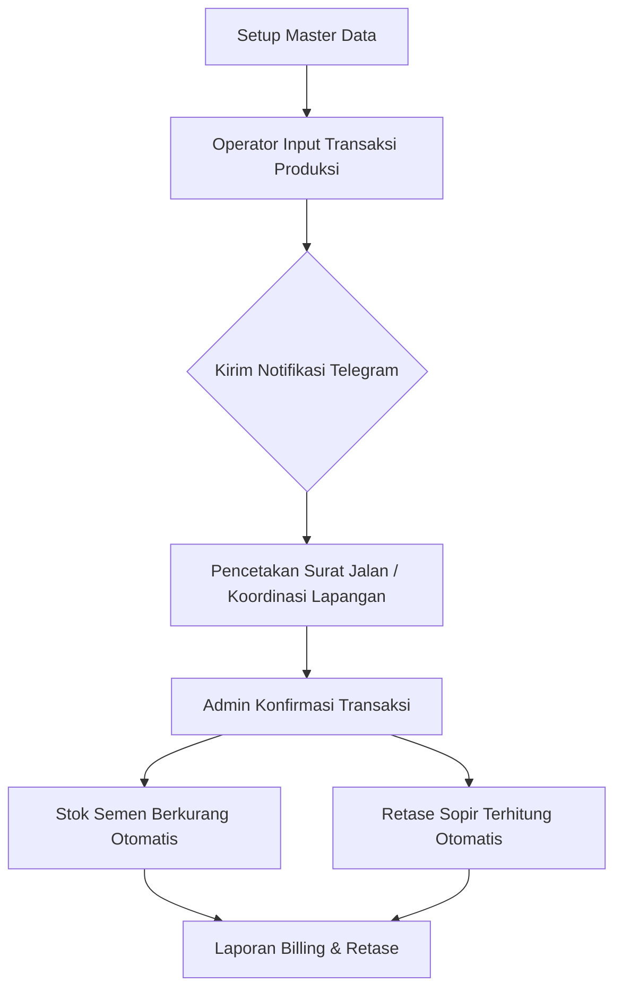

# Work Instruction: Sistem Manajemen New Rajawali Batching Plant

Dokumen ini disusun sebagai panduan operasional penggunaan aplikasi **New Rajawali CRM/POS**, sebuah sistem terintegrasi untuk manajemen operasional Batching Plant, mulai dari manajemen data master, kontrol produksi, hingga perhitungan otomatis komisi driver (retase).

---

## Daftar Isi

1. [Pendahuluan](#pendahuluan)
2. [Peran dan Akses Pengguna](#peran-dan-akses-pengguna)
3. [Eksplorasi Fitur Utama](#eksplorasi-fitur-utama)
    - [3.1 Dashboard Operasional](#31-dashboard-operasional)
    - [3.2 Manajemen Master Data](#32-manajemen-master-data)
    - [3.3 Manajemen Produksi](#33-manajemen-produksi)
    - [3.4 Logistik & Stok Material](#34-logistik--stok-material)
    - [3.5 Keuangan & Retase](#35-keuangan--retase)
    - [3.6 Pelaporan (Reports)](#36-pelaporan-reports)
4. [Alur dan Prosedur Aplikasi](#alur-dan-prosedur-aplikasi)
    - [4.1 Alur Siklus Produksi](#41-alur-siklus-produksi)
    - [4.2 Alur Perhitungan Retase Driver](#42-alur-perhitungan-retase-driver)
5. [Sistem Notifikasi & Audit](#sistem-notifikasi--audit)

---

## 1. Pendahuluan
Aplikasi New Rajawali dirancang untuk menyederhanakan proses pencatatan pengiriman beton, otomatisasi surat jalan via Telegram, dan eliminasi kesalahan manual dalam perhitungan gaji/komisi sopir berdasarkan volume dan jarak tempuh.

## 2. Peran dan Akses Pengguna
Aplikasi ini memiliki 3 tingkatan akses utama:

| Peran | Deskripsi Akses |
| :--- | :--- |
| **Super Admin** | Akses penuh ke seluruh cabang, manajemen pengguna, pengaturan global, dan laporan gabungan. |
| **Admin Cabang** | Mengelola operasional cabang tertentu, melakukan konfirmasi transaksi, dan menginput stok material. |
| **Operator** | Melakukan input transaksi produksi harian dan memantau antrian surat jalan. |

## 3. Eksplorasi Fitur Utama

### 3.1 Dashboard Operasional
Tampilan real-time yang menyajikan indikator kinerja utama (KPI):
- **Statistik Harian**: Total volume produksi (m³), jumlah trip, status transaksi (Pending/Confirmed).
- **Statistik Bulanan**: Akumulasi produksi dan performa bulanan.
- **Trend Produksi**: Grafik 7 hari terakhir untuk memantau fluktuasi permintaan.
- **Estimasi Stok Semen**: Perhitungan otomatis sisa stok semen (Material Masuk - Pemakaian Berdasarkan Komposisi Mutu).
- **Top Customer**: Daftar pelanggan dengan volume pemesanan tertinggi.

### 3.2 Manajemen Master Data
Modul fondasi untuk mengatur data dasar operasional:
- **Cabang (Location)**: Pengaturan lokasi batching plant.
- **Karyawan**: Data personel (Sopir, Operator, Admin) beserta status aktif/non-aktif.
- **Kendaraan**: Data armada Mixer dan Loader (Nomor Plat, Kode Unit).
- **Customer & Project**: Data pelanggan beserta detail proyek, jarak tempuh default, dan pengaturan pajak (PPN).
- **Mutu Beton**: Pengaturan komposisi campuran beton (pasir, batu, semen) untuk kalkulasi stok otomatis.

### 3.3 Manajemen Produksi (Input Produksi)
Fitur utama untuk operasional harian:
- **Input Trip**: Mencatat transaksi pengiriman mencakup Customer, Kendaraan, Sopir, Mutu Beton, dan Volume.
- **Trip Sequence**: Otomatisasi nomor urutan trip (TM-1, TM-2, dst) per proyek per hari.
- **Integrasi Telegram**: Sistem secara otomatis mengirimkan rincian surat jalan ke grup Telegram untuk koordinasi lapangan yang cepat.

### 3.4 Logistik & Stok Material
- **Material Masuk**: Pencatatan penerimaan material mentah (Semen, Pasir, Batu) dari supplier.
- **Pemakaian Material**: Secara otomatis dikurangi dari stok berdasarkan volume produksi yang dikonfirmasi dan standar komposisi mutu beton yang telah ditentukan.

### 3.5 Keuangan & Retase
- **Konfirmasi Transaksi**: Admin melakukan validasi trip produksi untuk memastikan data akurat sebelum dihitung dalam sistem keuangan.
- **Kalkulasi Retase**: Otomatisasi perhitungan pendapatan sopir dengan rumus: `Volume x Jarak x Harga Dasar per Satuan`.
- **Settings Retase**: Pengaturan harga dasar retase yang fleksibel per cabang.

### 3.6 Pelaporan (Reports)
- **Billing Report**: Laporan penagihan ke customer berdasarkan periode tertentu.
- **Retase Report**: Rekapitulasi pendapatan driver untuk penggajian.
- **Audit Log**: Jejak rekam setiap perubahan atau penghapusan data untuk keamanan dan transparansi.

---

## 4. Alur dan Prosedur Aplikasi

### 4.1 Alur Siklus Produksi

### 4.2 Alur Perhitungan Retase Driver
1. **Pemicu**: Transaksi produksi diubah statusnya menjadi **"Confirmed"** oleh Admin.
2. **Data Input**: Sistem mengambil `Volume Cubic`, `Default Distance` dari data customer, dan `Price per Cubic KM` dari pengaturan cabang.
3. **Hasil**: Record baru tercipta di tabel Retase yang langsung dapat dilihat pada laporan pendapatan driver.

---

## 5. Sistem Notifikasi & Audit
- **Telegram Bot**: Menjamin transparansi setiap trip yang keluar dari plant. Setiap input produksi akan memicu pesan ke Telegram yang berisi: *No Trip, Nama Customer, Sopir, Plat No, Mutu, dan Volume.*
- **Security Audit**: Setiap aksi **EDIT** atau **DELETE** pada data transaksi akan direkam oleh sistem (Siapa, Kapan, Data Lama, Data Baru) untuk mencegah manipulasi data.

---
*Dokumen ini merupakan bagian dari operasional standar New Rajawali. Harap update dokumen jika terdapat perubahan alur sistem di masa depan.*
