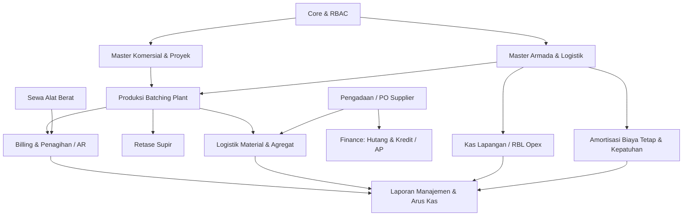

# HIGH-LEVEL DESIGN (HLD) DATABASE & REPORTING GUIDE
## Sistem ERP & CRM PT Rajawali Perkasa Jaya (New Rajawali CRM)

> **PRINSIP UTAMA: ZERO GUESSWORK (DILARANG MENERKA DATA)**
> Seluruh kalkulasi laporan finansial, analitik operasional, stok material, dan arus kas WAJIB mengacu pada struktur skema, relasi relasional, dan satuan fisik yang terdokumentasi di sini. **Dilarang keras menyematkan angka asumsi, konstanta perkiraan, atau rumus *fallback* sepihak.**

---

## 1. Peta Domain Arsitektur Database (High-Level Domain Map)

Database New Rajawali CRM terbagi ke dalam **12 domain bisnis utama**:

---

## 2. Struktur Domain, Tabel, & Tanggung Jawab Data

### Domain 1: Core, Organisasi & RBAC
* **`Location`**: Master unit cabang operasional (misal: Cabang Jayapura, Koya, Sentani, dll.).
  - Semua transaksi operasional terikat ke `locationId` untuk segmentasi data per cabang.
* **`User` & `Employee`**: Akun login dan data master karyawan (operator, supir, staf, admin, pimpinan).
* **`Role`, `Permission`, `RolePermission`**: Konfigurasi hak akses berbasis RBAC granular.

### Domain 2: Master Komersial & Pelanggan
* **`Customer`**: Data klien/pembeli beton, sewa alat, atau agregat.
* **`Project`**: Lokasi proyek/pekerjaan milik pelanggan. Satu customer bisa memiliki banyak project.
* **`ProjectPrice`**: Tabel acuan harga jual per proyek dan per mutu beton.
  - `price`: Nilai harga satuan (Rp).
  - `ppn_mode`: `"NON_PPN"`, `"INCLUDE"`, atau `"EXCLUDE"`.
  - `ppn_rate`: Tarif PPN (default 11%).
  - *Aturan Laporan:* DPP dihitung dari formula: jika INCLUDE $\rightarrow \text{price} / (1 + \text{ppnRate}/100)$, jika EXCLUDE $\rightarrow \text{price}$, jika NON_PPN $\rightarrow \text{price}$.

### Domain 3: Mutu Beton & Resep Mix Design (Batching Plant)
* **`ConcreteQuality`**: Master mutu beton (K-175, K-225, K-300, FC 20, MORTAR, dll.).
  - `composition_cement`: Berat semen dalam **Kg per m³ beton**.
  - `composition_sand`: Berat pasir dalam **Kg per m³ beton**.
  - `composition_stone_12`: Berat batu split 1-2 dalam **Kg per m³ beton**.
  - `composition_stone_23`: Berat batu split 2-3 dalam **Kg per m³ beton**.
  - `composition_stone_05`: Berat ciping 0-5 dalam **Kg per m³ beton**.
  - `density_sand`: Berat jenis pasir (default **1.400 kg/m³**).
  - `density_stone_12`: Berat jenis batu 1-2 (default **1.450 kg/m³**).
  - `density_stone_23`: Berat jenis batu 2-3 (default **1.450 kg/m³**).
  - `density_stone_05`: Berat jenis ciping (default **1.400 kg/m³**).
  > **ATURAN MUTLAK:** Jika suatu mutu beton tidak menggunakan fraksi tertentu (contoh: **MORTAR** di mana `composition_stone_* = 0`), maka pemakaian batu adalah **0**. Dilarang mengisi dengan angka fallback perkiraan!

### Domain 4: Transaksi Produksi & Surat Jalan
* **`ProductionTransaction`**: Tiket pengiriman beton (tiket cor / batching).
  - `volume_cubic`: Volume pengiriman dalam satuan **m³**.
  - `qualityId`: Relasi ke `ConcreteQuality` (**NON-NULLABLE / WAJIB ADA**).
  - `projectId`: Relasi ke proyek pemesan.
  - `vehicleId`: Mixer truck pengantar.
  - `driverId`: Supir pengemudi.
  - `status`: `"Draft"`, `"Confirmed"`, `"Cancelled"`.
  - *Aturan Laporan:* Hanya transaksi dengan status `"Confirmed"` yang dihitung sebagai realisasi produksi, omset penjualan, dan pemakaian bahan.
  - `invoiceItem`: Relasi 1-to-1 opsional jika tiket sudah ditagihkan ke dalam invoice.

### Domain 5: Logistik Material & Agregat Masuk
* **`MaterialIncoming`**: Penerimaan semen dari pabrikan (curah silo / zak).
  - `tonnage`: Jumlah semen masuk dalam satuan **Kg**.
  - `total_price`: Nilai total pembelian.
* **`AggregateIncoming`**: Penerimaan pasir dan batu split dari *quarry*.
  - `volume_cubic`: Volume agregat masuk dalam satuan **m³ (Kubikasi)**.
  - `aggregate_type`: `"Pasir"`, `"Split 1/2"`, `"Split 2/3"`, dll.
  - `retase_amount`: Upah retase dump truck pengangkut pasir/batu.
* **`AggregateOutgoing`**: Pengeluaran agregat keluar untuk jobsite/penjualan.

### Domain 6: Retase & Insentif Supir
* **`Retase`**: Catatan insentif ritase supir mixer truck atas tiket produksi (`ProductionTransaction`).
  - `income_amount`: Nominal upah retase yang diterima supir per trip.
  - *Aturan Laporan:* Biaya upah supir mixer dihitung dari $\sum \text{income\_amount}$ pada periode bersangkutan.

### Domain 7: Billing, Invoice, Piutang (AR) & Pembayaran
* **`Invoice`**: Dokumen penagihan resmi kepada pelanggan.
  - `total_amount`: Total nominal tagihan bruto.
  - `paid_amount`: Akumulasi nominal yang telah dibayarkan oleh pelanggan.
  - `status`: `"DRAFT"`, `"ISSUED"`, `"PARTIAL"`, `"PAID"`, `"CANCELLED"`.
* **`Payment`**: Realisasi pencatatan kas/bank penerimaan pembayaran dari pelanggan.
  - `payment_date`: **Tanggal Bayar Riil** (kapan dana ditransfer/masuk rekening bank, bisa disetel *backdate* jika pencatatan susulan).
  - `createdAt`: **Tanggal Lapor / Input Sistem** (kapan staf admin menginputkan ke database).
  - `amount`: Jumlah uang kas yang diterima (Rp).
  - `method`: `"TRANSFER"`, `"CASH"`, `"GIRO"`, `"DEPOSIT"`.
  - `is_cancelled`: Flag soft-cancel jika pembayaran dibatalkan/void.
  - *Aturan Laporan Cash Flow:* Arus kas masuk (`Inflow`) dihitung dari `Payment` di mana `is_cancelled = false` dan `payment_date` berada pada rentang bulan laporan.
* **`Deposit`**: Uang muka/titipan pembayaran pelanggan sebelum terbit invoice.
* **`BillingLog`**: Jejak audit permanen (*immutable*) untuk setiap pembuatan invoice, pelunasan, atau pembatalan.

### Domain 8: Pengadaan Logistik & Purchase Order (PO)
* **`PurchaseOrder`**: Pesanan pembelian barang/jasa kepada vendor/supplier.
  - `po_number`: Nomor unik PO (e.g. `PO-2026/09/001`).
  - `is_for_bp`: Penanda apakah PO ditujukan untuk operasional Batching Plant (`true`) atau holding/proyek lain (`false`).
  - `metode_pembayaran`: `"CASH"`, `"CREDIT"`, `"TRANSFER"`.
  - `status`: `"DRAFT"`, `"SUBMITTED"`, `"APPROVED"`, `"REJECTED"`, `"CANCELLED"`.
* **`PoCategory`**: Kategori PO (`kode_kategori: "SMN"` untuk Semen, `"SPR"` untuk Sparepart/Suku Cadang, `"BBM"` untuk Solar, dll.).
* **`PoItem`**: Rincian barang per baris PO (`quantity`, `harga_satuan`, `subtotal`).

### Domain 9: Kas Operasional Lapangan (RBL / Branch Petty Cash)
* **`RblBudget`**: Plafon anggaran kas operasional bulanan cabang (`periodMonth`, `periodYear`, `amount`).
* **`RblExpense`**: Bukti riil pengeluaran kas tunai di lapangan.
  - `amount`: Nilai pengeluaran kas (Rp).
  - `date`: Tanggal transaksi pengeluaran kas.
  - `categoryId`: Relasi ke master kategori RBL.
  - *Pemisahan Akuntansi:*
    1. **BBM Solar Kas:** Kategori `cat-bbm-solar` atau nama mengandung `"bbm"/"solar"`. (Masuk ke **COGS / Beban Pokok**).
    2. **Perawatan Bengkel Kas:** Kategori `cat-pemeliharaan` atau nama mengandung `"sparepart"/"servis"/"bengkel"`. (Masuk ke **COGS / Beban Pokok**).
    3. **RBL Opex Murni:** Seluruh kategori kas operasional kantor selain BBM & Servis. (Masuk ke **Overhead Operasional Seksi D**).
  - *Aturan Laporan Cash Flow:* **Total Kas Keluar Lapangan (Outflow)** adalah penjumlahan seluruh pengeluaran kas tunai: $\text{BBM Kas} + \text{Bengkel Kas} + \text{RBL Opex Murni}$.

### Domain 10: Sewa Alat Berat (Equipment Rental)
* **`MasterSewaAlat`**: Data pompa beton (*concrete pump*), excavator, loader, genset.
* **`SewaTransaction`**: Transaksi penyewaan alat berat ke pelanggan.
  - Memiliki `dpp`, `ppn_amount`, `gross_amount`.
  - Terhubung ke invoice via `InvoiceItem`.

### Domain 11: Beban Tetap, Amortisasi & Kepatuhan Kendaraan
* **`FixedCostContract`**: Kontrak beban tetap berulang (Sewa Tanah Batching Plant, Sewa Mess Karyawan, Izin Usaha, dll.).
  - `monthly_amount`: Beban amortisasi per bulan.
* **`VehicleComplianceRecord`**: Biaya kepatuhan armada (Pajak STNK & Uji KIR).
  - `monthly_amount`: Nilai amortisasi per bulan ($\text{cost} / \text{period\_months}$).
  - *Aturan Laporan:* Dimasukkan ke dalam laporan bulanan sebagai beban amortisasi jika rentang tanggal `valid_from` dan `valid_until` melingkupi bulan laporan.

### Domain 12: Finance - Hutang Usaha & Kewajiban (Accounts Payable / Kredit)
* **`CreditObligation`**: Pencatatan kewajiban hutang perusahaan kepada supplier (dari PO Kredit Approved atau Non-PO).
  - `total_amount`, `paid_amount`, `outstanding`.
  - `credit_date` (timbulnya hutang) & `due_date` (jatuh tempo).
* **`CreditPayment`**: Realisasi pelunasan hutang ke supplier via kas/bank holding.
  - `payment_date`: Tanggal nyata transfer keluar.
  - `is_cancelled`: Flag soft-cancel.

---

## 3. Kamus Satuan Ukur Standar (Units of Measurement - UoM)

| Objek Data | Satuan Ukur Standar | Aturan Konversi Fisik | Keterangan Bisnis |
| :--- | :---: | :--- | :--- |
| **Produksi Beton** | $\text{m}^3$ (Meter Kubik) | - | Volume pengiriman tiket *ready-mix*. |
| **Semen (Cement)** | $\text{Kg}$ atau $\text{Ton}$ | $1\text{ Ton} = 1.000\text{ Kg}$ $1\text{ Zak} = 50\text{ Kg}$ | Dihitung dari $\text{Volume } (\text{m}^3) \times \text{composition\_cement}$. |
| **Pasir (Sand)** | $\text{Kg}$ (Fisik) & $\text{m}^3$ (Kubikasi) | $\text{Volume } (\text{m}^3) = \frac{\text{Massa } (\text{kg})}{1.400\text{ kg/m}^3}$ | Lapangan menggunakan timbangan Kg; PO & HPP Jayapura menggunakan $\text{m}^3$. |
| **Batu Split 1-2** | $\text{Kg}$ (Fisik) & $\text{m}^3$ (Kubikasi) | $\text{Volume } (\text{m}^3) = \frac{\text{Massa } (\text{kg})}{1.450\text{ kg/m}^3}$ | Fraksi batu pecah ukuran 10–20 mm. |
| **Batu Split 2-3** | $\text{Kg}$ (Fisik) & $\text{m}^3$ (Kubikasi) | $\text{Volume } (\text{m}^3) = \frac{\text{Massa } (\text{kg})}{1.450\text{ kg/m}^3}$ | Fraksi batu pecah ukuran 20–30 mm. |
| **Ciping / Batu 0-5** | $\text{Kg}$ (Fisik) & $\text{m}^3$ (Kubikasi) | $\text{Volume } (\text{m}^3) = \frac{\text{Massa } (\text{kg})}{1.400\text{ kg/m}^3}$ | Abu batu / ciping screening. |
| **BBM Solar** | $\text{Liter}$ atau $\text{Rp}$ | - | Pengisian armada mixer & genset plant. |
| **Rupiah (Mata Uang)** | $\text{IDR (Rp)}$ | Format: `Intl.NumberFormat('id-ID')` | Dibulatkan ke integer terdekat tanpa desimal sen. |

---

## 4. Perbedaan Mendasar: Laporan Akrual (P&L) vs. Arus Kas Riil (Cash Flow)

Pengembang sistem dan AI agent **DILARANG MENCAMPURADUKKAN** antara Laba Akrual dan Arus Kas:

### A. Laba Akrual (Seksi 1.1 - Performa Pengiriman Beton)
* **Basis Pengakuan:** Mengakui pendapatan dan beban pada saat **beton dikirimkan** (`ProductionTransaction.status = "Confirmed"`), terlepas dari apakah invoice sudah dibayar oleh pelanggan atau belum.
* **Pendapatan (Revenue):** Nilai DPP dari beton yang terkirim pada bulan bersangkutan.
* **HPP / COGS Material:** Bahan baku teoritis yang terpakai sesuai resep *mix design* atas kubikasi beton yang dikirim bulan tersebut.
* **Tujuan:** Mengetahui apakah operasional pabrik di bulan tersebut untung atau rugi.

### B. Arus Kas Riil (Seksi 1.2 - Likuiditas Bank & Kas Lapangan)
* **Basis Pengakuan:** Mengakui uang masuk dan uang keluar pada saat **kas/bank benar-benar berpindah tangan**:
  - **Kas Masuk (Inflow):** $\sum \text{Payment.amount}$ di mana `payment_date` berada pada bulan bersangkutan (mencakup pelunasan invoice bulan lalu, piutang lama, dan deposit).
  - **Kas Keluar (Outflow):** $\sum \text{RblExpense.amount}$ kas operasional cabang yang dibelanjakan pada bulan bersangkutan.
* **Tujuan:** Mengetahui kecukupan dana tunai, kesehatan penagihan (*collection*), dan likuiditas kas perusahaan.

---

## 5. Aturan Penting Database (Golden Rules untuk Pengembang & AI Agent)

1. **Selalu Bedakan `payment_date` vs `createdAt`:**
   - Gunakan `payment_date` untuk filter laporan keuangan/cash flow (kapan uang nyata masuk).
   - Gunakan `createdAt` hanya untuk audit log sistem (kapan user mencatat di sistem).
2. **Larangan Keras Coding Fallback Sembarangan (Anti-Silent Fallback & Phantom Data):**
   - **Bedakan Technical Safe Fallback vs Business Logic Fallback:**
     - *Boleh (Technical Safety):* `val ?? 0`, `val ?? ""`, `arr ?? []` untuk mencegah runtime error (null pointer exception) pada tipe data.
     - *DILARANG KERAS (Business Logic Fallback):* Menulis angka tebakan/perkiraan non-nol seperti `splitFactor || 0.85`, `pasirFactor || 0.72`, `cementPerM3 || 350`, atau `cost || 50000` di dalam kalkulasi laporan, HPP, atau transaksi.
   - **Nilai 0 Adalah Data Sah (Valid Value):** Angka 0 dalam database bukanlah "data hilang/kosong", melainkan fakta teknis riil (contoh: produk **MORTAR** memang 0 split, transaksi non-PPN memang 0 pajak). Jangan pernah menggunakan operator `||` yang menganggap angka 0 sebagai falsy lalu menggantinya dengan nilai perkiraan. Wajib gunakan `??` (nullish coalescing) dengan nilai netral 0.
   - **Dilarang Menyembunyikan Anomali Data (No Silent Fallback):** Jika data master atau relasi yang wajib ada ternyata tidak ditemukan, sistem harus mengeksposnya (menghasilkan nilai 0 atau melempar error), BUKAN menyamarkannya secara diam-diam dengan angka rekaan yang melahirkan "data siluman" (*phantom data*) dan merusak laporan keuangan.
3. **Pencegahan Timezone Shift pada Tanggal:**
   - String tanggal `"YYYY-MM-DD"` dari kalender input harus diparsing aman dengan jam tengah hari UTC (`T12:00:00.000Z`) agar tidak bergeser hari ke belakang di server dengan perbedaan zona waktu (WIB/WITA/WIT).
4. **Validasi Status Transaksi:**
   - Hitung produksi hanya untuk `status = "Confirmed"`.
   - Hitung PO hanya untuk `status = "APPROVED"`.
   - Hitung invoice hanya untuk `status != "CANCELLED"`.
   - Hitung payment hanya untuk `is_cancelled = false`.
