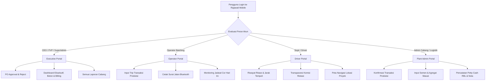

# 📱 DOKUMEN SPESIFIKASI & ROADMAP FITUR SISTEM RAJAWALI UNTUK APLIKASI ANDROID
**PT Rajawali Mix — Sistem Terintegrasi CRM/POS & Mobile Application**  
*Path Target Aplikasi Android: `D:\Project Free\RajawaliApp\app`*  
*Dokumentasi Versi: 1.0.0 | Terakhir Diperbarui: 5 September 2026*

---

## 📑 Daftar Isi
1. [Pendahuluan & Tujuan](#1-pendahuluan--tujuan)
2. [Arsitektur & Pemetaan Ekosistem (Web CRM vs Android)](#2-arsitektur--pemetaan-ekosistem)
3. [Matriks Status Fitur (Existing vs To-Be-Implemented)](#3-matriks-status-fitur)
4. [Rincian Fitur Baru yang Perlu Diimplementasikan](#4-rincian-fitur-baru-yang-perlu-diimplementasikan)
   - [4.1 Modul Operasional Produksi & Surat Jalan (Batching Plant)](#41-modul-operasional-produksi--surat-jalan)
   - [4.2 Modul Driver Portal & Komisi Retase (Sopir Truk Mixer)](#42-modul-driver-portal--komisi-retase)
   - [4.3 Modul Logistik & Stok Material Masuk (Semen & Agregat)](#43-modul-logistik--stok-material-masuk)
   - [4.4 Modul Perencanaan Pengecoran (Concrete Planning)](#44-modul-perencanaan-pengecoran)
   - [4.5 Modul Kas Lapangan / Petty Cash (Rencana Biaya Lapangan - RBL)](#45-modul-kas-lapangan--petty-cash-rbl)
   - [4.6 Modul Customer, Proyek & Pembayaran Billing](#46-modul-customer-proyek--pembayaran-billing)
   - [4.7 Modul Manajemen Armada & Alat Berat (Fleet Management)](#47-modul-manajemen-armada--alat-berat)
   - [4.8 Peningkatan Fitur yang Sudah Berjalan (Executive & PO Approval)](#48-peningkatan-fitur-yang-sudah-berjalan)
5. [Spesifikasi Teknis API Backend (Endpoints & Data Contract)](#5-spesifikasi-teknis-api-backend)
6. [Kebutuhan Fitur Native Mobile (Hardware & Offline)](#6-kebutuhan-fitur-native-mobile)
7. [Matriks Peran Pengguna (Role-Based Access Control di Mobile)](#7-matriks-peran-pengguna-mobile)
8. [Rekomendasi Roadmap Implementasi Bertahap](#8-rekomendasi-roadmap-implementasi-bertahap)

---

## 1. Pendahuluan & Tujuan

Aplikasi **Rajawali Mobile** (`RajawaliApp`) saat ini telah berfungsi dengan baik sebagai **Executive & Approval Portal** bagi jajaran pimpinan (CEO, FVP, Super Admin) untuk:
- Meninjau dan menyetujui *Purchase Order* (PO) pengadaan logistik.
- Memantau metrik ringkasan produksi beton, logistik, dan piutang penagihan (*Executive Dashboard*).
- Menerima *push notification* berbasis Firebase Cloud Messaging (FCM).

Namun, sistem backend utama **New Rajawali CRM** memiliki ekosistem operasional yang jauh lebih lengkap, mencakup kontrol batching plant, pencatatan material harian, koordinasi armada mixer, penghitungan komisi sopir (retase), perencanaan pengecoran, hingga pencatatan kas operasional lapangan (RBL).

Dokumen ini disusun sebagai **panduan induk (single source of truth)** bagi tim pengembang untuk memperluas fungsionalitas aplikasi Android (`D:\Project Free\RajawaliApp\app`), mentransformasikan aplikasi dari sekadar portal approval pimpinan menjadi **super-app operasional lapangan dan manajemen batching plant yang terpadu**.

---

## 2. Arsitektur & Pemetaan Ekosistem

```
┌────────────────────────────────────────────────────────────────────────────────────────┐
│                               BACKEND & DATABASE UTAMA                                 │
│                         Next.js API Routes + Prisma ORM + PostgreSQL                  │
└────────────────────────────────────────────────────────────┬───────────────────────────┘
                                                             │
                  ┌──────────────────────────────────────────┴──────────────────────────┐
                  ▼                                                                     ▼
┌───────────────────────────────────┐                 ┌──────────────────────────────────────────────────┐
│          WEB DASHBOARD            │                 │              RAJAWALI ANDROID APP                │
│    (Next.js 15 + Shadcn/UI)       │                 │          (Kotlin Jetpack Compose + Room)         │
├───────────────────────────────────┤                 ├──────────────────────────────────────────────────┤
│ • Super Admin Global Control      │                 │ 🟢 EXISTING (Executive):                        │
│ • Full Billing & Invoicing        │                 │   - PO Approval & Reject (CEO/FVP)               │
│ • User & RBAC Management          │                 │   - Executive, Beton, Billing, & PO Dashboard   │
│ • Detailed Production Master Data │                 │   - FCM Push Notification Alerts                 │
│ • Heavy Reporting & Audit Trail   │                 │ 🟡 TARGET PENAMBAHAN (Field & Operations):       │
│ • Batching Settings & Formulas    │                 │   - Modul Input & Konfirmasi Produksi            │
└───────────────────────────────────┘                 │   - Portal Ritase & Komisi Driver (Sopir)        │
                                                      │   - Input Logistik Material & Stok Lapangan      │
                                                      │   - Perencanaan Pengecoran (Concrete Plan)       │
                                                      │   - Kas Operasional / Petty Cash Lapangan (RBL)  │
                                                      │   - Print Surat Jalan Bluetooth Thermal          │
                                                      │   - Offline Sync & Local Caching                 │
                                                      └──────────────────────────────────────────────────┘
```

---

## 3. Matriks Status Fitur

Tabel berikut memetakan seluruh kapabilitas sistem di **New Rajawali** dan status implementasinya pada aplikasi Android saat ini:

| No | Modul & Fitur | Status di Web CRM | Status di Android (`RajawaliApp`) | Prioritas Target | Role Pengguna Target |
|:---:|:---|:---:|:---:|:---:|:---|
| **1** | **Autentikasi & Keamanan** |
| 1.1 | Login Akun & JWT Token | ✅ Selesai | ✅ Selesai (`LoginScreen`) | - | Semua Pengguna |
| 1.2 | Registrasi Token FCM Mobile | ✅ Selesai | ✅ Selesai (`ApiService.kt`) | - | Semua Pengguna |
| 1.3 | Autentikasi Biometrik (Fingerprint/Face) | N/A (Web) | 🟡 Siap Diintegrasikan | P2 | Semua Pengguna |
| 1.4 | Ganti Password & Profil Pengguna | ✅ Selesai | 🔴 Belum Ada | P3 | Semua Pengguna |
| **2** | **Purchase Order (Logistik & Sparepart)** |
| 2.1 | Monitoring Daftar PO & Filter Status | ✅ Selesai | ✅ Selesai (`PoListScreen`) | - | CEO, FVP, Admin |
| 2.2 | Detail PO & Breakdown Item | ✅ Selesai | ✅ Selesai (`PoDetailScreen`) | - | CEO, FVP, Admin |
| 2.3 | Eksekusi Approval / Reject Multi-Level | ✅ Selesai | ✅ Selesai (`updatePurchaseOrderStatus`) | - | CEO, FVP |
| 2.4 | Pembuatan Draft PO Baru dari Mobile | ✅ Selesai | 🔴 Belum Ada | P3 | Admin Logistik, Mekanik |
| **3** | **Executive Dashboard & Monitoring** |
| 3.1 | Ringkasan Eksekutif KPI Utama | ✅ Selesai | ✅ Selesai (`HomeScreen`) | - | CEO, FVP |
| 3.2 | Dashboard Logistik & PO Spending | ✅ Selesai | ✅ Selesai (`PoDashboardScreen`) | - | CEO, FVP, Logistik |
| 3.3 | Dashboard Produksi Beton Real-Time | ✅ Selesai | ✅ Selesai (`BetonDashboardScreen`) | - | CEO, FVP, Admin |
| 3.4 | Dashboard Billing & Saldo Piutang | ✅ Selesai | ✅ Selesai (`BillingDashboardScreen`) | - | CEO, FVP, Admin |
| **4** | **Operasional Produksi (Batching Plant)** |
| 4.1 | Input Transaksi Produksi / Pengiriman Trip | ✅ Selesai | 🔴 Belum Ada | **P1 (Utama)** | Operator Batching |
| 4.2 | Trip Sequence Otomatis (TM-1, TM-2, dst) | ✅ Selesai | 🔴 Belum Ada | **P1 (Utama)** | Operator Batching |
| 4.3 | Validasi / Konfirmasi Transaksi (Pending ➔ Confirmed) | ✅ Selesai | 🔴 Belum Ada | **P1 (Utama)** | Admin Cabang |
| 4.4 | Cetak Surat Jalan via Thermal Printer Bluetooth | 🟡 Cetak Web | 🔴 Belum Ada | **P1 (Utama)** | Operator, Sopir |
| 4.5 | Broadcast Surat Jalan ke Telegram Otomatis | ✅ Selesai | 🟡 Terpicu Otomatis di Server | P2 | Sistem / Operator |
| **5** | **Driver Portal & Manajemen Retase** |
| 5.1 | Riwayat Trip Harian & Bulanan Sopir | ✅ Selesai | 🔴 Belum Ada | **P1 (Utama)** | Sopir (Driver) |
| 5.2 | Kalkulasi Transparan Komisi Retase Driver | ✅ Selesai | 🔴 Belum Ada | **P1 (Utama)** | Sopir (Driver) |
| 5.3 | Mode Hitung Fleksibel (Jarak Saja vs Jarak & Volume) | ✅ Selesai | 🔴 Belum Ada | **P1 (Utama)** | Sopir, Admin Cabang |
| 5.4 | Konfirmasi Status Tiba di Lokasi Proyek | N/A | 🔴 Belum Ada | P2 | Sopir (Driver) |
| **6** | **Logistik Material Masuk & Kontrol Stok** |
| 6.1 | Catat Semen Masuk (Tonnage, Supplier, No Bon) | ✅ Selesai | 🔴 Belum Ada | P2 | Admin Logistik Lapangan |
| 6.2 | Catat Agregat Masuk (Split 1/2, 2/3, Pasir, Internal/External) | ✅ Selesai | 🔴 Belum Ada | P2 | Admin Logistik Lapangan |
| 6.3 | Pantau Sisa Stok Material Real-Time | ✅ Selesai | 🟡 Sebagian di Dashboard | P2 | Admin Cabang, Logistik |
| 6.4 | Foto & Lampiran Surat Jalan Supplier | ✅ Selesai | 🔴 Belum Ada | P2 | Admin Logistik Lapangan |
| **7** | **Perencanaan Pengecoran (Concrete Plan)** |
| 7.1 | Jadwal Rencana Pengecoran Harian/Mingguan | ✅ Selesai | 🔴 Belum Ada | P2 | Operator, Admin Cabang |
| 7.2 | Update Status Rencana (Planned, OnGoing, Done, Cancelled) | ✅ Selesai | 🔴 Belum Ada | P2 | Operator, Admin Cabang |
| **8** | **Petty Cash Lapangan / RBL (Rencana Biaya Lapangan)** |
| 8.1 | Informasi Anggaran RBL Aktif per Periode/Bulan | ✅ Selesai | 🔴 Belum Ada | P2 | Admin Cabang |
| 8.2 | Input Pengeluaran Kas Lapangan (Expense) + Nota | ✅ Selesai | 🔴 Belum Ada | P2 | Admin Cabang |
| 8.3 | Upload & Preview Foto Bukti Pengeluaran (Attachment) | ✅ Selesai | 🔴 Belum Ada | P2 | Admin Cabang |
| 8.4 | Tutup Buku / Close Period RBL Lapangan | ✅ Selesai | 🔴 Belum Ada | P3 | Admin Cabang, Finance |
| **9** | **Master Data & Hubungan Customer / Proyek** |
| 9.1 | Direktori Pelanggan & Lokasi Proyek Pengecoran | ✅ Selesai | 🔴 Belum Ada | P3 | Sales, Admin Cabang |
| 9.2 | Cek Saldo Deposit Pelanggan | ✅ Selesai | 🔴 Belum Ada | P3 | Sales, Finance |
| 9.3 | Catat Penerimaan Pembayaran Invoice di Lapangan | ✅ Selesai | 🔴 Belum Ada | P3 | Collector, Kasir |

---

## 4. Rincian Fitur Baru yang Perlu Diimplementasikan

### 4.1 Modul Operasional Produksi & Surat Jalan
*Tujuan: Memungkinkan operator batching plant menginput pengiriman beton langsung dari perangkat tablet atau smartphone di dekat panel batching tanpa bergantung pada PC desktop.*

#### Fungsionalitas:
1. **Formulir Input Pengiriman (New Trip Dispatch)**:
   - **Pemilihan Entitas**: Dropdown dinamis untuk Proyek (terhubung ke Customer), Truk Mixer (armada aktif), Sopir (karyawan aktif posisi *Sopir*), Mutu Beton (misal K-225, K-300), dan Item Pekerjaan (misal Rigid, Sloof, Kolom).
   - **Parameter Teknis**: Input Nilai Slump (misal `12±2 cm`), Volume Kubik (`m³`).
   - **Kalkulasi Akumulasi & Trip Sequence**: Sistem secara otomatis menentukan nomor urutan armada (`TM-1`, `TM-2`, dst) dan menghitung akumulasi volume cor untuk proyek tersebut pada hari berjalan.
2. **Antrean Transaksi & Status Validasi**:
   - Status **`Pending`**: Status bawaan saat operator selesai menginput trip.
   - Status **`Confirmed`**: Validasi yang dieksekusi oleh Admin Cabang setelah tiket pengiriman fisik kembali dan diverifikasi. Konfirmasi ini memicu:
     - Pengurangan stok semen dan agregat secara otomatis sesuai standar racikan mutu.
     - Penerbitan catatan komisi retase sopir.
3. **Pencetakan Surat Jalan Digital (Thermal Bluetooth Printing)**:
   - Layout struk standar Surat Jalan ukuran 58mm / 80mm:
     - Header: Nama Perusahaan, Logo, Lokasi Plant.
     - Nomor Surat Jalan / Trip Sequence.
     - Customer, Nama Proyek, Alamat Pengantaran.
     - Jam Cetak, No Plat Kendaraan, Nama Sopir.
     - Spesifikasi Mutu Beton, Nilai Slump, Volume (m³), Akumulasi Volume.
     - Kolom Tanda Tangan: Dibuat oleh (Operator), Dibawa oleh (Sopir), Diterima oleh (Pelanggan Lapangan).
4. **Pembagian Dokumen Digital**:
   - Fitur bagikan (*share*) ringkasan surat jalan dalam format gambar / PDF ke WhatsApp proyek atau grup koordinasi.

---

### 4.2 Modul Driver Portal & Komisi Retase
*Tujuan: Memberikan transparansi kepada pengemudi truk mixer terkait pencapaian trip dan estimasi penghasilan komisi perjalanan (retase).*

#### Fungsionalitas:
1. **Beranda Khusus Pengemudi (Driver Dashboard)**:
   - Rekapitulasi hari ini: Total ritase (trip yang diselesaikan), total volume diantar ($m^3$), dan estimasi perolehan komisi rupiah.
   - Rekapitulasi bulanan: Akumulasi ritase dan status konfirmasi admin.
2. **Rincian Perhitungan Retase Otomatis**:
   - Menampilkan rumus transparan sesuai konfigurasi cabang tempat sopir bertugas:
     - **Mode `DISTANCE_ONLY`**: $\text{Pendapatan} = \text{Jarak Tempuh (KM)} \times \text{Tarif Dasar (Rp/KM)}$
     - **Mode `DISTANCE_AND_VOLUME`**: $\text{Pendapatan} = \text{Volume } (m^3) \times \text{Jarak Tempuh (KM)} \times \text{Tarif Dasar (Rp/}m^3\text{/KM)}$
3. **Daftar Riwayat Perjalanan**:
   - Kartu riwayat pengantaran dengan detail nomor trip, proyek tujuan, waktu berangkat, volume angkut, dan nominal rupiah komisi.
4. **Navigasi & Panduan Lokasi Proyek**:
   - Tombol cepat buka Google Maps menuju alamat proyek yang tercatat di sistem.

---

### 4.3 Modul Logistik & Stok Material Masuk
*Tujuan: Pencatatan penerimaan material curah dan agregat di lapangan untuk menjaga keakuratan persediaan stok.*

#### Fungsionalitas:
1. **Penerimaan Semen Curah / Sak (`MaterialIncoming`)**:
   - Input tanggal penerimaan, nama supplier, jenis semen (misal Tonasa, Bosowa, Dynamix), nomor surat jalan/bon supplier, dan kuantitas tonase (dikonversi ke satuan kilogram).
   - Fitur kamera untuk melampirkan foto fisik surat jalan dari armada supplier.
2. **Penerimaan Agregat Kasar & Halus (`AggregateIncoming`)**:
   - Pencatatan batu split 1/2, split 2/3, dan pasir.
   - Pilihan sumber: **Internal** (quarry milik sendiri) atau **External** (pembelian pihak ketiga).
   - Data pengemudi logistik, plat nomor truk tronton/dump truck, nomor bon, dan volume kubik ($m^3$).
3. **Monitor Estimasi Sisa Stok**:
   - Menampilkan saldo teoritis persediaan:
     $$\text{Sisa Stok Semen} = \sum \text{Semen Masuk} - \sum (\text{Volume Cor Confirmed} \times \text{Komposisi Semen Mutu})$$
   - Indikator peringatan visual jika stok berada di bawah batas minimum aman operasional (*safety stock*).

---

### 4.4 Modul Perencanaan Pengecoran (Concrete Planning)
*Tujuan: Sinkronisasi rencana jadwal pengecoran dari tim sales/marketing ke tim produksi batching plant.*

#### Fungsionalitas:
1. **Kalender Rencana Pengecoran**:
   - Tampilan jadwal agenda cor harian dan mingguan.
   - Informasi volume rencana ($m^3$), proyek pemesan, mutu beton yang dipesan, dan estimasi waktu mulai pengecoran.
2. **Pemantauan Realisasi Produksi**:
   - Progress bar perbandingan antara volume rencana vs volume yang telah terkirim ($m^3$ terkirim / $m^3$ rencana).
3. **Pengelolaan Status Rencana**:
   - Perubahan status operasional langsung dari perangkat genggam: `Planned` ➔ `OnGoing` ➔ `Done` (atau `Cancelled` jika batal).

---

### 4.5 Modul Kas Lapangan / Petty Cash (RBL - Rencana Biaya Lapangan)
*Tujuan: Memfasilitasi pelaporan dan pertanggungjawaban kas kecil operasional cabang secara akuntabel dan transparan.*

#### Fungsionalitas:
1. **Monitoring Alokasi Anggaran RBL**:
   - Memantau plafon anggaran bulanan yang disalurkan oleh Head Office (HO) untuk cabang terkait.
   - Menampilkan total dana diterima, total pengeluaran terealisasi, dan sisa saldo kas fisik di plant.
2. **Pencatatan Beban Pengeluaran (`RblExpense`)**:
   - Input cepat belanja operasional harian (misal: konsumsi lembur operator, solar genset darurat, tambal ban mixer, pelumas, perlengkapan K3).
   - Atribut: Tanggal, Deskripsi Item, Kategori Beban, Qty, Satuan, Harga Satuan, Total, dan Nomor Kuitansi/Nota.
3. **Unggah Bukti Fisik Bon/Nota (`RblAttachment`)**:
   - Ambil foto struk belanja menggunakan kamera smartphone dengan kompresi otomatis agar hemat bandwidth.
   - Galeri lampiran untuk audit internal.
4. **Rekapitulasi dan Penutupan Periode**:
   - Ringkasan pembukuan bulanan sebelum periode dinyatakan ditutup (`CLOSED`).

---

### 4.6 Modul Customer, Proyek & Pembayaran Billing
*Tujuan: Memberikan akses informasi komersial bagi pimpinan, tim sales, dan petugas kasir lapangan.*

#### Fungsionalitas:
1. **Direktori Pelanggan & Proyek Aktif**:
   - Informasi daftar proyek pengecoran aktif, alamat proyek, dan jarak tempuh default dari plant.
   - Daftar mutu beton yang disepakati beserta tarif kontrak per mutu.
2. **Pemantauan Saldo Deposit Proyek**:
   - Menampilkan saldo deposit uang muka yang telah disetor pelanggan untuk proyek tertentu.
3. **Pencatatan Pembayaran Tagihan Lapangan (`Payment`)**:
   - Input pembayaran invoice: Metode pembayaran (Transfer, Tunai, Giro, atau Pemotongan Saldo Deposit).
   - Lampiran bukti transfer atau foto kuitansi penagihan fisik.

---

### 4.7 Modul Manajemen Armada & Alat Berat
*Tujuan: Memastikan pemantauan kondisi kendaraan operasional dan pengawasan jam kerja alat berat.*

#### Fungsionalitas:
1. **Status Kesiapan Armada Mixer & Loader**:
   - Daftar armada per cabang: Nomor polisi, kode lambung kendaraan, dan tipe unit (Mixer / Wheel Loader).
   - Status kesiapan (Siap Operasi, Sedang Pengiriman, Standby di Plant, Dalam Perbaikan/Bengkel).
2. **Pencatatan Kilometer (KM) / Hour Meter (HM)**:
   - Validasi pembacaan odometer / hour meter untuk kebutuhan pengajuan sparepart (terintegrasi dengan modul PO kategori sparepart/SPR).

---

### 4.8 Peningkatan Fitur yang Sudah Berjalan
*Tujuan: Menyempurnakan modul yang sudah ada di aplikasi Android saat ini.*

1. **Peningkatan PO Approval**:
   - Fitur *Batch Approval*: Menyetujui beberapa dokumen PO sekaligus dengan satu kali konfirmasi bagi pimpinan.
   - Pratinjau dokumen KOP resmi PO lengkap dengan stempel dan tanda tangan digital.
2. **Peningkatan Executive Dashboard**:
   - Pemilihan Cabang (*Branch Filter Selector*) bagi akun pimpinan berscope `ALL_BRANCHES`.
   - Date range picker yang lebih fleksibel (Harian, Mingguan, Bulanan, Custom Range).
   - Fitur *Pull-to-Refresh* dan indikator caching data.

---

## 5. Spesifikasi Teknis API Backend

Untuk mengimplementasikan fitur-fitur di atas, backend New Rajawali perlu menyediakan endpoints RESTful JSON dengan autentikasi `Bearer Token`. Berikut rancangan antarmuka API yang dibutuhkan:

### 5.1 Endpoint Produksi & Surat Jalan
```http
POST   /api/production/transactions
Headers: Authorization: Bearer <token>
Body:
{
  "locationId": "uuid",
  "projectId": "uuid",
  "vehicleId": "uuid",
  "driverId": "uuid",
  "qualityId": "uuid",
  "workItemId": "uuid",
  "volume_cubic": 7.0,
  "slump": "12±2",
  "date": "2026-09-05T14:30:00Z"
}

GET    /api/production/transactions?locationId=xxx&date=2026-09-05&status=Pending
Headers: Authorization: Bearer <token>

PATCH  /api/production/transactions/{id}/confirm
Headers: Authorization: Bearer <token>
Description: Mengubah status transaksi menjadi Confirmed dan memicu hitung retase otomatis

GET    /api/production/references?locationId=xxx
Description: Mengambil master data dropdown (Proyek, Kendaraan, Driver, Mutu, Item Pekerjaan)
```

### 5.2 Endpoint Driver Portal & Retase
```http
GET    /api/driver/my-trips?month=9&year=2026
Headers: Authorization: Bearer <token>
Response:
{
  "driverName": "Budi Santoso",
  "totalTrips": 42,
  "totalVolume": 294.0,
  "totalIncome": 4410000,
  "calcMode": "DISTANCE_ONLY",
  "trips": [
    {
      "id": "uuid",
      "date": "2026-09-05T10:00:00Z",
      "tripSequence": 1,
      "projectName": "Jalan Tol Seksi 2",
      "plateNumber": "DT 8920 AR",
      "volume": 7.0,
      "distanceKm": 15.0,
      "commissionAmount": 105000,
      "status": "Confirmed"
    }
  ]
}
```

### 5.3 Endpoint Logistik Material Masuk
```http
POST   /api/logistik/material-in
Body: { "material_type": "Semen", "name": "Tonasa", "supplier": "PT Semen Tonasa", "tonnage": 30000, "delivery_note": "SJ-99812", "locationId": "uuid", "date": "..." }

POST   /api/logistik/aggregate-in
Body: { "aggregate_type": "SplitHalfOne", "source_type": "Internal", "driver_name": "Anto", "plate_number": "DT 8111 AB", "volume_cubic": 24.5, "no_bon": "BON-401", "locationId": "uuid", "date": "..." }

GET    /api/logistik/stock-summary?locationId=uuid
Response: { "semenKg": 145000, "pasirM3": 320.5, "splitHalfOneM3": 210.0, "splitTwoThreeM3": 185.0 }
```

### 5.4 Endpoint Kas Operasional Lapangan (RBL)
```http
GET    /api/rbl/current?locationId=uuid
Response: Detail budget aktif, total pengeluaran, sisa kas

POST   /api/rbl/expense
Body: { "budgetId": "uuid", "date": "...", "itemDescription": "Solar Genset Darurat", "category": "BBM", "quantity": 30, "unit": "Liter", "unitPrice": 14000, "receiptNo": "STR-001" }

POST   /api/rbl/attachment
Form-Data: file=<image_binary>, budgetId="uuid", caption="Nota Solar"
```

---

## 6. Kebutuhan Fitur Native Mobile

Aplikasi Android yang dikembangkan di `D:\Project Free\RajawaliApp\app` perlu memanfaatkan kemampuan perangkat keras (hardware) smartphone:

1. **Bluetooth Thermal Printer Integration (ESC/POS)**:
   - Integrasi library Bluetooth SPP (Serial Port Profile).
   - Format template teks cetak otomatis disesuaikan dengan ukuran kertas 58mm atau 80mm.
2. **Kamera & Kompresi Citra (Image Compression Engine)**:
   - Pengambilan foto bukti nota RBL, kuitansi penagihan, dan surat jalan supplier.
   - Kompresi sisi klien (*client-side compression*) sebelum diunggah ke server (maksimal ~500 KB per foto) agar pengiriman cepat di area minim sinyal 4G.
3. **Penyimpanan Lokal & Sinkronisasi Offline (Room Database)**:
   - Caching master data proyek, mutu beton, dan armada ke dalam database lokal Room.
   - Kemampuan operator tetap mencatat trip pengiriman saat jaringan batching plant offline, dengan antrean sinkronisasi otomatis (*background sync worker*) saat internet kembali tersambung.
4. **Geolokasi & Pemetaan (Google Maps SDK / Intent)**:
   - Tautan navigasi satu sentuhan dari kartu trip pengemudi langsung menuju titik lokasi proyek pengecoran.
5. **Autentikasi Biometrik (AndroidX BiometricPrompt)**:
   - Login instan menggunakan sidik jari (*fingerprint*) atau pengenalan wajah (*face unlock*) untuk kenyamanan pimpinan dan staf lapangan.

---

## 7. Matriks Peran Pengguna (Mobile RBAC)

Aplikasi Android menggunakan arsitektur **Single App, Multi-Persona**. Tampilan antarmuka beradaptasi secara otomatis berdasarkan peran (`role`) pengguna yang login:



---

## 8. Rekomendasi Roadmap Implementasi Bertahap

Untuk menjamin stabilitas dan percepatan rilis, pengembangan fitur pada `D:\Project Free\RajawaliApp\app` direkomendasikan dibagi menjadi 4 tahap utama:

### 🚀 Tahap 1: Operasional Inti Lapangan & Driver (Prioritas P1)
- [ ] Implementasi endpoint API referensi produksi & transaksi pengiriman.
- [ ] Pembuatan UI Input Produksi (`ProductionInputScreen`) untuk Operator.
- [ ] Integrasi cetak struk Surat Jalan via Bluetooth Thermal Printer.
- [ ] Pembuatan Portal Khusus Sopir (`DriverRitaseScreen`) untuk memantau trip dan komisi retase harian/bulanan.
- [ ] Alur konfirmasi transaksi produksi oleh Admin Cabang.

### 📦 Tahap 2: Logistik Material & Kas Operasional RBL (Prioritas P2)
- [ ] Pembuatan modul pencatatan Semen Masuk & Agregat Masuk.
- [ ] Integrasi kamera native untuk foto surat jalan supplier & kompresi gambar.
- [ ] Pembuatan modul RBL (pencatatan pengeluaran lapangan & upload foto nota).
- [ ] Tampilan ringkasan estimasi stok material plant.

### 📅 Tahap 3: Perencanaan Produksi & Finansial Lapangan (Prioritas P2 & P3)
- [ ] Modul jadwal rencana pengecoran (`ConcretePlanningScreen`).
- [ ] Direktori pelanggan, proyek, dan saldo deposit.
- [ ] Fitur pencatatan pembayaran kuitansi tagihan lapangan.
- [ ] Batch Approval untuk dokumen Purchase Order pimpinan.

### 🛡️ Tahap 4: Offline-First, Biometrik & Penguatan Sistem (Prioritas P3)
- [ ] Integrasi database lokal Android (Room DB) untuk mode offline input produksi.
- [ ] Otentikasi Biometrik (Fingerprint/Face) saat membuka aplikasi.
- [ ] Peningkatan caching dan sinkronisasi otomatis latar belakang (*WorkManager*).
- [ ] Audit log mobile untuk rekonsiliasi data.

---

*Dokumen ini disusun untuk tim pengembang internal PT Rajawali Mix. Semua penambahan kode dan endpoint backend wajib mengacu pada skema Prisma yang berlaku.*
