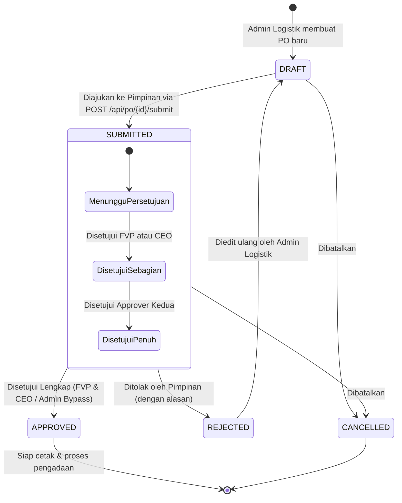

# 📱 DOKUMENTASI LENGKAP REST API UNTUK APLIKASI ANDROID
**PT Rajawali Mix — Sistem Terintegrasi New Rajawali CRM Backend**  
*Target: Android App Developer (`RajawaliApp`)*  
*Dokumentasi Versi: 2.0.0 | Terakhir Diperbarui: September 2026*  

---

## 📑 Daftar Isi
1. [Standar & Konvensi API](#1-standar--konvensi-api)
   - [Base URL & Pengaturan Jaringan](#base-url--pengaturan-jaringan)
   - [Header Autentikasi (JWT Bearer Token)](#header-autentikasi-jwt-bearer-token)
   - [Format Respon Standar](#format-respon-standar)
2. [Lifecycle & State Machine Approval PO (DRAFT, SUBMITTED, APPROVED)](#2-lifecycle--state-machine-approval-po)
   - [Diagram Alur State Machine](#diagram-alur-state-machine)
   - [Aturan Peran & Hak Akses (RBAC Approval)](#aturan-peran--hak-akses-rbac-approval)
3. [Modul 1: Autentikasi & Profil Pengguna](#3-modul-1-autentikasi--profil-pengguna)
   - [3.1 Login Akun (Mobile JWT)](#31-login-akun-mobile-jwt)
   - [3.2 Registrasi FCM Token (Push Notifications)](#32-registrasi-fcm-token-push-notifications)
   - [3.3 Ambil Profil & Tanda Tangan Digital Tersimpan](#33-ambil-profil--tanda-tangan-digital-tersimpan)
   - [3.4 Simpan Master Tanda Tangan Digital](#34-simpan-master-tanda-tangan-digital)
4. [Modul 2: Upload File & Tanda Tangan Digital](#4-modul-2-upload-file--tanda-tangan-digital)
   - [4.1 Upload Tanda Tangan (Canvas Base64)](#41-upload-tanda-tangan-canvas-base64)
   - [4.2 Upload File Fisik (Multipart Form Data)](#42-upload-file-fisik-multipart-form-data)
   - [4.3 Mengakses / Menampilkan File Statis](#43-mengakses--menampilkan-file-statis)
5. [Modul 3: Purchase Order (PO) & Approval Engine](#5-modul-3-purchase-order-po--approval-engine)
   - [5.1 Antrean Approval (Pending & History)](#51-antrean-approval-pending--history)
   - [5.2 Detail Lengkap Purchase Order](#52-detail-lengkap-purchase-order)
   - [5.3 Pengajuan PO ke Pimpinan (`DRAFT` ➔ `SUBMITTED`)](#53-pengajuan-po-ke-pimpinan-draft--submitted)
   - [5.4 Eksekusi Approval / Penolakan (`APPROVED`, `REJECTED`, `CANCELLED`)](#54-eksekusi-approval--penolakan-approved-rejected-cancelled)
   - [5.5 Daftar Seluruh PO (Daftar + Pencarian + Filter)](#55-daftar-seluruh-po-daftar--pencarian--filter)
   - [5.6 Metadata Filter Dropdown PO](#56-metadata-filter-dropdown-po)
   - [5.7 Ringkasan Agregat PO (Summary Belanja)](#57-ringkasan-agregat-po-summary-belanja)
6. [Modul 4: Executive & Operational Dashboard](#6-modul-4-executive--operational-dashboard)
   - [6.1 Executive Overview KPI Dashboard](#61-executive-overview-kpi-dashboard)
   - [6.2 Logistik & Pengadaan Dashboard](#62-logistik--pengadaan-dashboard)
   - [6.3 Produksi Beton Dashboard](#63-produksi-beton-dashboard)
   - [6.4 Billing & Penagihan Dashboard](#64-billing--penagihan-dashboard)
7. [Modul 5: Kas Lapangan / Petty Cash (Rencana Biaya Lapangan - RBL)](#7-modul-5-kas-lapangan--petty-cash-rencana-biaya-lapangan---rbl)
   - [7.1 Cek Budget RBL Aktif di Cabang](#71-cek-budget-rbl-aktif-di-cabang)
   - [7.2 Ringkasan & Realisasi Anggaran Cabang](#72-ringkasan--realisasi-anggaran-cabang)
   - [7.3 Daftar Seluruh Budget RBL](#73-daftar-seluruh-budget-rbl)
   - [7.4 Input Transaksi Pengeluaran Kas Lapangan](#74-input-transaksi-pengeluaran-kas-lapangan)
   - [7.5 Upload Foto Bukti Nota / Kuitansi](#75-upload-foto-bukti-nota--kuitansi)
8. [Contoh Implementasi Kode Android (Kotlin + Retrofit)](#8-contoh-implementasi-kode-android-kotlin--retrofit)
   - [AuthInterceptor.kt](#authinterceptorkt)
   - [ApiService.kt](#apiservicekt)
   - [Data Model Utama (Data Classes)](#data-model-utama-data-classes)

---

## 1. Standar & Konvensi API

### Base URL & Pengaturan Jaringan
| Lingkungan | Base URL | Keterangan |
|---|---|---|
| **Android Emulator (Lokal)** | `http://10.0.2.2:3000` | Alamat alias loopback host dari emulator Android |
| **Perangkat Fisik (LAN/WiFi)** | `http://<IP_KOMPUTER_HOST>:3000` | Contoh: `http://192.168.1.50:3000` |
| **Server Produksi** | `https://crm.rajawalimix.com` | Menggunakan SSL HTTPS resmi |

> [!IMPORTANT]
> Pastikan file `AndroidManifest.xml` pada project Android telah memiliki izin internet dan mengizinkan traffic HTTP lokal:
> ```xml
> <uses-permission android:name="android.permission.INTERNET" />
> </application android:usesCleartextTraffic="true" ...>
> ```

### Header Autentikasi (JWT Bearer Token)
Hampir seluruh endpoint (kecuali endpoint login) memerlukan header otentikasi JWT:
```http
Authorization: Bearer <TOKEN_JWT_DARI_LOGIN>
Content-Type: application/json
```

### Format Respon Standar
Backend menggunakan envelope JSON konsisten:
- **Respon Berhasil (HTTP 200 / 201)**:
  ```json
  {
    "success": true,
    "message": "Operasi berhasil dilakukan",
    "data": { ... }
  }
  ```
- **Respon Gagal (HTTP 400, 401, 403, 404, 500)**:
  ```json
  {
    "error": "Pesan deskripsi kesalahan yang mudah dipahami pengguna"
  }
  ```

---

## 2. Lifecycle & State Machine Approval PO

Sistem Purchase Order logistik menerapkan siklus verifikasi 3 tahap utama (`DRAFT`, `SUBMITTED`, `APPROVED`) ditambah penolakan (`REJECTED`) dan pembatalan (`CANCELLED`):

### Diagram Alur State Machine



### Rincian 3 Status Utama:
1. **`DRAFT`**:
   - Status saat PO baru saja dibuat oleh Admin Logistik di sistem web.
   - Pada status ini, PO **belum muncul** di antrean approval pimpinan (belum ada notifikasi push).
   - Item dan harga masih bisa diperbaiki oleh staf logistik.
2. **`SUBMITTED`**:
   - PO telah final dicek oleh tim logistik dan resmi **diajukan ke jajaran direksi/approver**.
   - Sistem secara otomatis mengirimkan **Firebase Cloud Messaging (FCM)** ke ponsel pimpinan serta membunyikan **Pusher Realtime Event**.
   - PO masuk ke daftar antrean `GET /api/po/approvals?status=pending`.
3. **`APPROVED`**:
   - PO telah disetujui secara sah.
   - Pimpinan membubuhkan **Tanda Tangan Digital** (bisa digores langsung di layar HP atau memakai tanda tangan tersimpan).
   - Tanda tangan digital beserta catatan disematkan ke dokumen PO resmi untuk keperluan audit dan pencetakan surat PO.
4. **`REJECTED` (Pendukung)**:
   - Jika ditolak oleh salah satu approver (misal: harga kemahalan atau kuantitas berlebih), status berubah menjadi `REJECTED` dengan menyertakan `rejectionReason`.
   - Admin pembuat PO dapat memperbaiki data lalu mengajukannya ulang (`SUBMITTED`) kembali.

### Aturan Peran & Hak Akses (RBAC Approval)
- **`CEO`**: Menyetujui porsi direktur utama (`ceoApprovedAt`, `ceoSignatureUrl`, `ceoNotes`).
- **`FVP`** / **`Approver`**: Menyetujui porsi direktur operasional/FVP (`fvpApprovedAt`, `fvpSignatureUrl`, `fvpNotes`).
- **`SuperAdminBP`**: Memiliki izin bypass sistem untuk persetujuan darurat (tanpa membubuhkan tanda tangan fisik pimpinan).

---

## 3. Modul 1: Autentikasi & Profil Pengguna

### 3.1 Login Akun (Mobile JWT)
Mendapatkan token JWT yang memiliki masa aktif **30 hari** khusus untuk aplikasi mobile.

- **Endpoint**: `POST /api/auth/login`
- **Auth**: None
- **Request Body**:
  ```json
  {
    "username": "ceo_user",
    "password": "Password123!"
  }
  ```
- **Response Berhasil (200 OK)**:
  ```json
  {
    "success": true,
    "token": "eyJhbGciOiJIUzI1NiIsInR5cCI6IkpXVCJ9...",
    "user": {
      "id": "usr_998127391283",
      "username": "ceo_user",
      "role": "CEO",
      "employeeName": "Ir. Hendra Wijaya",
      "position": "CEO",
      "location": "Pusat"
    }
  }
  ```
- **Response Gagal (401 Unauthorized)**:
  ```json
  {
    "error": "Invalid credentials"
  }
  ```

---

### 3.2 Registrasi FCM Token (Push Notifications)
Mendaftarkan token perangkat Android ke database pengguna agar menerima notifikasi saat ada PO baru yang diajukan (`SUBMITTED`).

- **Endpoint**: `PATCH /api/auth/fcm-token`
- **Auth**: `Bearer <TOKEN>`
- **Request Body**:
  ```json
  {
    "fcmToken": "c7x9A1b..._token_dari_firebase_messaging"
  }
  ```
- **Response Berhasil (200 OK)**:
  ```json
  {
    "success": true,
    "message": "FCM token updated successfully"
  }
  ```

---

### 3.3 Ambil Profil & Tanda Tangan Digital Tersimpan
Mengecek apakah pimpinan yang sedang login sudah memiliki tanda tangan digital tersimpan di server.

- **Endpoint**: `GET /api/user/signature`
- **Auth**: `Bearer <TOKEN>`
- **Response Berhasil (200 OK)**:
  ```json
  {
    "success": true,
    "data": {
      "id": "usr_998127391283",
      "username": "ceo_user",
      "role": "CEO",
      "signatureUrl": "/api/files/signatures/sig_usr_998127391283_1725612345.png"
    }
  }
  ```
  *(Jika `signatureUrl` bernilai `null`, aplikasi menampilkan Canvas TTD kosong untuk dibuatkan terlebih dahulu).*

---

### 3.4 Simpan Master Tanda Tangan Digital
Menyimpan URL tanda tangan digital sebagai master profil user sehingga bisa digunakan berulang kali untuk approval cepat (Quick Approve).

- **Endpoint**: `POST /api/user/signature`
- **Auth**: `Bearer <TOKEN>`
- **Request Body**:
  ```json
  {
    "signatureUrl": "/api/files/signatures/sig_usr_998127391283_1725612345.png"
  }
  ```
- **Response Berhasil (200 OK)**:
  ```json
  {
    "success": true,
    "data": {
      "id": "usr_998127391283",
      "username": "ceo_user",
      "signatureUrl": "/api/files/signatures/sig_usr_998127391283_1725612345.png"
    }
  }
  ```

---

## 4. Modul 2: Upload File & Tanda Tangan Digital

### 4.1 Upload Tanda Tangan (Canvas Base64)
Sangat cocok untuk komponen Canvas Android. Hasil goresan tanda tangan di-convert ke string Base64 PNG lalu dikirimkan ke server.

- **Endpoint**: `POST /api/upload`
- **Auth**: `Bearer <TOKEN>`
- **Header**: `Content-Type: application/json`
- **Request Body**:
  ```json
  {
    "imageBase64": "data:image/png;base64,iVBORw0KGgoAAAANSUhEUgAA...",
    "folder": "signatures"
  }
  ```
- **Response Berhasil (200 OK)**:
  ```json
  {
    "success": true,
    "url": "/api/files/signatures/sig_usr_998127391283_1725612345.png"
  }
  ```

---

### 4.2 Upload File Fisik (Multipart Form Data)
Untuk mengunggah file gambar kamera, nota kuitansi, atau PDF.

- **Endpoint**: `POST /api/upload`
- **Auth**: `Bearer <TOKEN>`
- **Header**: `Content-Type: multipart/form-data`
- **Form Data Parameters**:
  - `file`: File binary (JPG, PNG, WebP, PDF — maks 5MB)
  - `folder`: `"signatures"` atau `"payments"`
- **Response Berhasil (200 OK)**:
  ```json
  {
    "success": true,
    "url": "/api/files/payments/pay_1725612345_abc123.jpg"
  }
  ```

---

### 4.3 Mengakses / Menampilkan File Statis
Semua URL file yang diawali `/api/files/...` dapat diakses langsung dengan menambahkan Base URL server:
`http://10.0.2.2:3000/api/files/signatures/sig_...png`

Gunakan library image loader seperti **Coil** atau **Glide** di Android:
```kotlin
AsyncImage(
    model = "$BASE_URL$signatureUrl",
    contentDescription = "Tanda Tangan Digital",
    modifier = Modifier.size(150.dp, 80.dp)
)
```

---

## 5. Modul 3: Purchase Order (PO) & Approval Engine

### 5.1 Antrean Approval (Pending & History)
Menampilkan antrean PO yang membutuhkan tindakan persetujuan dari pimpinan yang sedang login.

- **Endpoint**: `GET /api/po/approvals`
- **Auth**: `Bearer <TOKEN>`
- **Query Parameters**:
  - `status`: `"pending"` (default: status `SUBMITTED` yang belum ditandatangani user) atau `"history"` (riwayat PO yang pernah diproses user)
- **Response Berhasil (200 OK)**:
  ```json
  {
    "success": true,
    "count": 2,
    "data": [
      {
        "id": "po_clx99238472918",
        "po_number": "PO-2026/09/001",
        "tanggal_terbit": "2026-09-06T00:00:00.000Z",
        "status": "SUBMITTED",
        "pimpinan": "Ir. Hendra Wijaya",
        "kepala_peralatan": "Bambang Sudiro",
        "pembuat_admin": "Admin Logistik Pusat",
        "metode_pembayaran": "CREDIT",
        "company": "PT Rajawali Mix Cabang Jayapura",
        "category": "Sparepart Batching Plant",
        "notes": "Penggantian bearing dan seal mixer unit 02",
        "pic_name": "Suryanto",
        "pic_phone": "08123456789",
        "total": 4500000.0,
        "submittedAt": "2026-09-06T08:30:00.000Z",
        "submittedBy": "Agus Staff Logistik",
        "fvpApprovedAt": null,
        "fvpApprovedBy": null,
        "fvpSignatureUrl": null,
        "fvpNotes": null,
        "ceoApprovedAt": null,
        "ceoApprovedBy": null,
        "ceoSignatureUrl": null,
        "ceoNotes": null,
        "rejectionReason": null,
        "items": [
          {
            "id": "item_123",
            "name": "Bearing SKF 6208",
            "satuan": "Pcs",
            "part_number": "SKF-6208-2RS",
            "merk": "SKF",
            "quantity": 2.0,
            "harga_satuan": 750000.0,
            "subtotal": 1500000.0,
            "keterangan": "Untuk drum mixer",
            "supplier": "CV Sumber Makmur Sparepart"
          }
        ]
      }
    ]
  }
  ```

---

### 5.2 Detail Lengkap Purchase Order
Mengambil rincian utuh satu PO termasuk riwayat tanda tangan digital FVP dan CEO.

- **Endpoint**: `GET /api/po/{id}`
- **Auth**: `Bearer <TOKEN>`
- **Response Berhasil (200 OK)**:
  ```json
  {
    "success": true,
    "data": {
      "id": "po_clx99238472918",
      "po_number": "PO-2026/09/001",
      "tanggal_terbit": "2026-09-06T00:00:00.000Z",
      "status": "SUBMITTED",
      "pimpinan": "Ir. Hendra Wijaya",
      "kepala_peralatan": "Bambang Sudiro",
      "pembuat_admin": "Admin Logistik Pusat",
      "metode_pembayaran": "CREDIT",
      "notes": "Urgent perbaikan mixer",
      "company": "PT Rajawali Mix Jayapura",
      "category": "Sparepart",
      "isBypassed": false,
      "submittedAt": "2026-09-06T08:30:00.000Z",
      "submittedBy": {
        "id": "usr_admin_logistik",
        "name": "Agus Staff Logistik"
      },
      "approvedBy": null,
      "fvpApprovedBy": {
        "id": "usr_fvp",
        "name": "Drs. Ahmad Dani",
        "channel": "MOBILE"
      },
      "fvpSignatureUrl": "/api/files/signatures/sig_fvp_123.png",
      "fvpNotes": "Disetujui, segera order barang",
      "ceoApprovedBy": null,
      "ceoSignatureUrl": null,
      "ceoNotes": null,
      "rejectionReason": null,
      "rejectedAt": null,
      "rejectedBy": null,
      "items": [
        {
          "id": "item_1",
          "name": "Bearing SKF 6208",
          "supplier": "CV Sumber Makmur",
          "quantity": 2.0,
          "satuan": "Pcs",
          "harga_satuan": 750000.0,
          "subtotal": 1500000.0,
          "keterangan": "Ganti berkala"
        }
      ],
      "total": 1500000.0
    }
  }
  ```

---

### 5.3 Pengajuan PO ke Pimpinan (`DRAFT` ➔ `SUBMITTED`)
Digunakan oleh Admin Logistik atau pembuat PO setelah PO selesai disusun atau diperbaiki pasca penolakan. Endpoint ini mengubah status menjadi `SUBMITTED` dan langsung mengirimkan Push Notification ke HP Approver/Pimpinan.

- **Endpoint**: `POST /api/po/{id}/submit`
- **Auth**: `Bearer <TOKEN>`
- **Body**: `{}` *(Kosong)*
- **Response Berhasil (200 OK)**:
  ```json
  {
    "success": true,
    "message": "PO PO-2026/09/001 berhasil diajukan untuk persetujuan.",
    "data": {
      "id": "po_clx99238472918",
      "status": "SUBMITTED"
    }
  }
  ```
- **Response Validasi (400 Bad Request)**:
  ```json
  {
    "error": "Hanya PO berstatus Draft atau Ditolak yang dapat diajukan."
  }
  ```

---

### 5.4 Eksekusi Approval / Penolakan (`APPROVED`, `REJECTED`, `CANCELLED`)
Digunakan oleh CEO, FVP, atau Approver untuk mengeksekusi keputusan persetujuan dari aplikasi mobile.

- **Endpoint**: `PATCH /api/po/{id}`
- **Auth**: `Bearer <TOKEN>` *(Role: CEO, FVP, Approver, SuperAdminBP)*
- **Header**: `Content-Type: application/json`

#### Skenario 1: Menyetujui PO dengan TTD Baru (dari Canvas)
```json
{
  "status": "APPROVED",
  "notes": "Harga wajar, setuju untuk diproses pengadaannya.",
  "signatureUrl": "/api/files/signatures/sig_usr_998127391283_1725612345.png"
}
```

#### Skenario 2: Menyetujui Cepat dengan TTD Tersimpan (Quick Approve)
```json
{
  "status": "APPROVED",
  "notes": "Approved via Android Quick Action",
  "useSavedSignature": true
}
```

#### Skenario 3: Menolak PO (`REJECTED`)
```json
{
  "status": "REJECTED",
  "notes": "Harga bearing terlalu mahal dibanding vendor sebelumnya. Harap cari perbandingan penawaran minimal 2 vendor lain."
}
```

#### Skenario 4: Membatalkan PO (`CANCELLED`)
```json
{
  "status": "CANCELLED",
  "notes": "Proyek ditunda, pengadaan sparepart dibatalkan."
}
```

- **Response Berhasil (200 OK)**:
  ```json
  {
    "success": true,
    "message": "PO successfully APPROVED",
    "data": {
      "status": "APPROVED"
    }
  }
  ```

> [!NOTE]
> Jika PO memerlukan persetujuan FVP dan CEO:
> - Saat FVP menyetujui, `fvpApprovedAt` terisi. Status PO tetap `SUBMITTED` (Disetujui Parsial).
> - Saat CEO menyetujui berikutnya, `ceoApprovedAt` terisi dan status PO berubah menjadi `APPROVED` (Disetujui Penuh).

---

### 5.5 Daftar Seluruh PO (Daftar + Pencarian + Filter)
Menampilkan seluruh arsip PO dengan filter komprehensif untuk halaman pencarian atau monitoring.

- **Endpoint**: `GET /api/po`
- **Auth**: `Bearer <TOKEN>`
- **Query Parameters**:
  - `page`: Nomor halaman (contoh: `1`, default `1`)
  - `limit`: Jumlah data per halaman (contoh: `15`, default `15`)
  - `status`: `"ALL"`, `"DRAFT"`, `"SUBMITTED"`, `"APPROVED"`, `"REJECTED"`, `"CANCELLED"`
  - `search`: Kata kunci nomor PO atau nama perusahaan (contoh: `"PO-2026"`, `"Jayapura"`)
  - `companyId`: Filter ID perusahaan/cabang
  - `categoryId`: Filter ID kategori PO
  - `month`: Filter bulan (1 - 12)
  - `year`: Filter tahun (contoh: `2026`)
  - `startDate` & `endDate`: Filter rentang tanggal terbit (`YYYY-MM-DD`)
- **Response Berhasil (200 OK)**:
  ```json
  {
    "success": true,
    "data": [
      {
        "id": "po_clx99238472918",
        "po_number": "PO-2026/09/001",
        "tanggal_terbit": "2026-09-06T00:00:00.000Z",
        "company": "PT Rajawali Mix Jayapura",
        "projectName": "Proyek Jembatan Youtefa",
        "category": "Sparepart",
        "status": "APPROVED",
        "total": 4500000.0
      }
    ],
    "summary": {
      "total_records": 48,
      "total_amount": 342500000.0
    },
    "meta": {
      "totalCount": 48,
      "limit": 15,
      "page": 1,
      "totalPages": 4
    }
  }
  ```

---

### 5.6 Metadata Filter Dropdown PO
Mengambil daftar master perusahaan, kategori, dan proyek untuk mengisi pilihan dropdown filter di Android.

- **Endpoint**: `GET /api/po/filters`
- **Auth**: `Bearer <TOKEN>`
- **Response Berhasil (200 OK)**:
  ```json
  {
    "success": true,
    "data": {
      "companies": [
        { "id": "comp_1", "name": "PT Rajawali Mix Jayapura", "kode_cabang": "JPR" },
        { "id": "comp_2", "name": "PT Rajawali Mix Sorong", "kode_cabang": "SRG" }
      ],
      "categories": [
        { "id": "cat_1", "name": "Sparepart Batching Plant", "kode_kategori": "SP-BP" },
        { "id": "cat_2", "name": "Oli & Pelumas", "kode_kategori": "LUB" }
      ],
      "projects": [
        { "id": "proj_1", "name": "Pembangunan Flyover", "companyGroupId": "comp_1" }
      ]
    }
  }
  ```

---

### 5.7 Ringkasan Agregat PO (Summary Belanja)
Menghitung total rupiah belanja PO secara cepat tanpa harus mengambil seluruh baris data.

- **Endpoint**: `GET /api/po/summary`
- **Auth**: `Bearer <TOKEN>`
- **Query Parameters**: Sama persis dengan `GET /api/po` (mendukung filter `month`, `year`, `companyId`, `categoryId`, `status`).
- **Response Berhasil (200 OK)**:
  ```json
  {
    "success": true,
    "summary": {
      "total_records": 12,
      "total_amount": 89450000.0
    }
  }
  ```

---

## 6. Modul 4: Executive & Operational Dashboard

### 6.1 Executive Overview KPI Dashboard
Ringkasan metrik lintas departemen untuk pimpinan (CEO & FVP) di halaman beranda aplikasi.

- **Endpoint**: `GET /api/dashboard/executive`
- **Auth**: `Bearer <TOKEN>`
- **Response Berhasil (200 OK)**:
  ```json
  {
    "success": true,
    "data": {
      "logistik": {
        "spendBulanIni": 145000000.0,
        "pendingApprovalsCount": 4
      },
      "beton": {
        "volumeProduksiBulanIni": 1248.5,
        "volumeProduksiHariIni": 48.0,
        "trend7Hari": [
          { "date": "2026-09-01", "volume": 32.0 },
          { "date": "2026-09-02", "volume": 45.5 }
        ]
      },
      "billing": {
        "totalPiutangOutstanding": 420000000.0
      }
    }
  }
  ```

---

### 6.2 Logistik & Pengadaan Dashboard
Menampilkan statistik pengeluaran PO, item paling banyak dibeli, dan breakdown per kategori belanja.

- **Endpoint**: `GET /api/dashboard/logistik`
- **Auth**: `Bearer <TOKEN>`
- **Query Parameters**: `startDate`, `endDate`, `companyGroupId`, `categoryId`
- **Response Berhasil (200 OK)**:
  ```json
  {
    "success": true,
    "data": {
      "totalSpend": 145000000.0,
      "totalPoCount": 28,
      "categoryBreakdown": [
        { "categoryName": "Sparepart", "totalAmount": 85000000.0, "percentage": 58.6 },
        { "categoryName": "Bahan Bakar & Oli", "totalAmount": 60000000.0, "percentage": 41.4 }
      ]
    }
  }
  ```

---

### 6.3 Produksi Beton Dashboard
Menampilkan volume kubikasi beton per hari/bulan dan rincian mutu beton yang paling banyak diproduksi.

- **Endpoint**: `GET /api/dashboard/beton`
- **Auth**: `Bearer <TOKEN>`
- **Query Parameters**: `startDate`, `endDate`, `branchId`, `mutuId`
- **Response Berhasil (200 OK)**:
  ```json
  {
    "success": true,
    "data": {
      "totalVolume": 1248.5,
      "totalTrip": 182,
      "mutuBreakdown": [
        { "mutuName": "K-300", "volume": 680.0, "percentage": 54.4 },
        { "mutuName": "K-250", "volume": 390.5, "percentage": 31.3 },
        { "mutuName": "K-175", "volume": 178.0, "percentage": 14.3 }
      ]
    }
  }
  ```

---

### 6.4 Billing & Penagihan Dashboard
Statistik faktur tagihan, pelunasan pembayaran, dan saldo deposit pelanggan.

- **Endpoint**: `GET /api/dashboard/billing`
- **Auth**: `Bearer <TOKEN>`
- **Response Berhasil (200 OK)**:
  ```json
  {
    "success": true,
    "data": {
      "totalPiutang": 420000000.0,
      "totalTerbayarBulanIni": 185000000.0,
      "fakturJatuhTempoCount": 6
    }
  }
  ```

---

## 7. Modul 5: Kas Lapangan / Petty Cash (Rencana Biaya Lapangan - RBL)

Modul ini digunakan oleh staf cabang untuk mengelola uang kas operasional lapangan dan dipantau secara langsung oleh direksi.

### 7.1 Cek Budget RBL Aktif di Cabang
Mengecek alokasi anggaran bulan berjalan yang berstatus `OPEN` beserta sisa saldo yang belum terpakai.

- **Endpoint**: `GET /api/rbl/active`
- **Auth**: `Bearer <TOKEN>`
- **Query Parameters**: `locationId` (opsional untuk Super Admin / Direksi, otomatis terkunci untuk user cabang)
- **Response Berhasil (200 OK)**:
  ```json
  {
    "success": true,
    "hasActiveBudget": true,
    "data": {
      "id": "rbl_clx881239128",
      "code": "RBL-JPR-2026-09",
      "periodMonth": 9,
      "periodYear": 2026,
      "amount": 25000000.0,
      "totalExpense": 8450000.0,
      "remainingBalance": 16550000.0,
      "absorptionPercentage": 33.8,
      "status": "OPEN",
      "expensesCount": 14,
      "attachmentsCount": 12,
      "categoryBreakdown": {
        "Konsumsi & Lembur": 2150000.0,
        "Perbaikan Darurat": 3800000.0,
        "BBM Alat Batching": 2500000.0
      },
      "expenses": [
        {
          "id": "exp_1",
          "date": "2026-09-05T10:00:00.000Z",
          "itemDescription": "Beli BBM Solar Genset Plant",
          "category": "Operasional",
          "quantity": 50.0,
          "unit": "Liter",
          "unitPrice": 15000.0,
          "amount": 750000.0,
          "receiptNo": "SPBU-9912",
          "notes": "Stok cadangan mati lampu",
          "createdByName": "Budi Operasional"
        }
      ]
    }
  }
  ```

---

### 7.2 Ringkasan & Realisasi Anggaran Cabang
Menampilkan komparasi anggaran dan penyerapan dana di seluruh cabang PT Rajawali Mix.

- **Endpoint**: `GET /api/rbl/summary`
- **Auth**: `Bearer <TOKEN>`
- **Query Parameters**: `year`, `month`, `locationId`
- **Response Berhasil (200 OK)**:
  ```json
  {
    "success": true,
    "data": {
      "period": { "year": 2026, "month": 9 },
      "overall": {
        "totalBudgetAllocated": 75000000.0,
        "totalExpense": 28400000.0,
        "remainingBalance": 46600000.0,
        "absorptionPercentage": 37.9,
        "openBudgetsCount": 3,
        "closedBudgetsCount": 0
      },
      "branchBreakdown": [
        {
          "locationId": "loc_jpr",
          "locationName": "Plant Jayapura",
          "status": "OPEN",
          "allocatedAmount": 25000000.0,
          "totalExpense": 8450000.0,
          "remainingBalance": 16550000.0,
          "absorptionPercentage": 33.8
        }
      ]
    }
  }
  ```

---

### 7.3 Daftar Seluruh Budget RBL
- **Endpoint**: `GET /api/rbl/budgets`
- **Auth**: `Bearer <TOKEN>`
- **Query Parameters**: `page`, `limit`, `status` (`"OPEN"`, `"CLOSED"`, `"ALL"`), `year`, `month`, `locationId`
- **Response**: List objek budget dengan paginasi.

---

### 7.4 Input Transaksi Pengeluaran Kas Lapangan
Mencatat satu atau beberapa baris nota belanja harian kas kecil dari smartphone Android.

- **Endpoint**: `POST /api/rbl/expenses`
- **Auth**: `Bearer <TOKEN>`
- **Request Body**:
  ```json
  {
    "budgetId": "rbl_clx881239128",
    "items": [
      {
        "date": "2026-09-06T14:30:00.000Z",
        "itemDescription": "Air Galon & Kopi Staf Lapangan",
        "category": "Konsumsi",
        "quantity": 5.0,
        "unit": "Galon",
        "unitPrice": 25000.0,
        "amount": 125000.0,
        "receiptNo": "NOTA-0012",
        "notes": "Kebutuhan rutin mingguan"
      }
    ]
  }
  ```
- **Response Berhasil (200 OK)**:
  ```json
  {
    "success": true,
    "message": "1 pengeluaran berhasil disimpan",
    "data": [
      {
        "id": "exp_clx992384",
        "amount": 125000.0,
        "itemDescription": "Air Galon & Kopi Staf Lapangan"
      }
    ]
  }
  ```

---

### 7.5 Upload Foto Bukti Nota / Kuitansi
Mengunggah hasil foto kamera kuitansi fisik pengeluaran RBL.

- **Endpoint**: `POST /api/rbl/attachments`
- **Auth**: `Bearer <TOKEN>`
- **Header**: `Content-Type: multipart/form-data`
- **Form Data Parameters**:
  - `budgetId`: ID budget RBL
  - `caption`: Deskripsi foto (contoh: "Kuitansi pembelian semen darurat")
  - `file`: File gambar (JPG/PNG)
- **Response Berhasil (200 OK)**:
  ```json
  {
    "success": true,
    "message": "1 lampiran berhasil diunggah",
    "data": [
      {
        "id": "att_123",
        "fileName": "nota_solar.jpg",
        "fileUrl": "/api/files/payments/pay_1725612345.jpg"
      }
    ]
  }
  ```

---

## 8. Contoh Implementasi Kode Android (Kotlin + Retrofit)

### AuthInterceptor.kt
Otomatis menyisipkan token JWT yang tersimpan di `EncryptedSharedPreferences` ke setiap permintaan API:

```kotlin
package com.rajawali.app.data.remote

import okhttp3.Interceptor
import okhttp3.Response

class AuthInterceptor(private val tokenProvider: () -> String?) : Interceptor {
    override fun intercept(chain: Interceptor.Chain): Response {
        val originalRequest = chain.request()
        val token = tokenProvider()

        val requestBuilder = originalRequest.newBuilder()
        if (!token.isNullOrEmpty()) {
            requestBuilder.addHeader("Authorization", "Bearer $token")
        }
        requestBuilder.addHeader("Accept", "application/json")

        return chain.proceed(requestBuilder.build())
    }
}
```

---

### ApiService.kt
Interface Retrofit lengkap untuk berkomunikasi dengan backend:

```kotlin
package com.rajawali.app.data.remote

import com.rajawali.app.data.model.*
import okhttp3.MultipartBody
import okhttp3.RequestBody
import retrofit2.Response
import retrofit2.http.*

interface RajawaliApiService {

    // --- AUTENTIKASI ---
    @POST("api/auth/login")
    suspend fun login(@Body req: LoginRequest): Response<LoginResponse>

    @PATCH("api/auth/fcm-token")
    suspend fun updateFcmToken(@Body req: FcmTokenRequest): Response<BaseResponse<Unit>>

    @GET("api/user/signature")
    suspend fun getUserSignature(): Response<BaseResponse<UserSignatureData>>

    @POST("api/user/signature")
    suspend fun saveUserSignature(@Body req: SaveSignatureRequest): Response<BaseResponse<UserSignatureData>>

    // --- UPLOAD ---
    @POST("api/upload")
    suspend fun uploadCanvasSignature(@Body req: UploadBase64Request): Response<UploadResponse>

    @Multipart
    @POST("api/upload")
    suspend fun uploadFile(
        @Part file: MultipartBody.Part,
        @Part("folder") folder: RequestBody
    ): Response<UploadResponse>

    // --- PURCHASE ORDER & APPROVAL ---
    @GET("api/po/approvals")
    suspend fun getPoApprovals(
        @Query("status") status: String = "pending" // "pending" | "history"
    ): Response<PoApprovalsResponse>

    @GET("api/po/{id}")
    suspend fun getPoDetail(
        @Path("id") id: String
    ): Response<BaseResponse<PurchaseOrderDetail>>

    @POST("api/po/{id}/submit")
    suspend fun submitPo(
        @Path("id") id: String
    ): Response<BaseResponse<PoSubmitResult>>

    @PATCH("api/po/{id}")
    suspend fun updatePoStatus(
        @Path("id") id: String,
        @Body req: PoApprovalDecisionRequest
    ): Response<PoApprovalDecisionResponse>

    @GET("api/po")
    suspend fun getPoList(
        @Query("page") page: Int = 1,
        @Query("limit") limit: Int = 15,
        @Query("status") status: String? = null,
        @Query("search") search: String? = null,
        @Query("month") month: Int? = null,
        @Query("year") year: Int? = null
    ): Response<PoListResponse>

    @GET("api/po/filters")
    suspend fun getPoFilters(): Response<BaseResponse<PoFilterMetadata>>

    // --- DASHBOARD ---
    @GET("api/dashboard/executive")
    suspend fun getExecutiveDashboard(): Response<BaseResponse<ExecutiveDashboardData>>

    // --- KAS LAPANGAN (RBL) ---
    @GET("api/rbl/active")
    suspend fun getActiveRbl(
        @Query("locationId") locationId: String? = null
    ): Response<ActiveRblResponse>

    @POST("api/rbl/expenses")
    suspend fun addRblExpenses(
        @Body req: AddRblExpenseRequest
    ): Response<BaseResponse<List<RblExpenseItem>>>
}
```

---

### Data Model Utama (Data Classes)

```kotlin
package com.rajawali.app.data.model

import com.google.gson.annotations.SerializedName

// Generic Base Envelope
data class BaseResponse<T>(
    val success: Boolean,
    val message: String?,
    val data: T?
)

// Login
data class LoginRequest(val username: String, val password: String)
data class LoginResponse(val success: Boolean, val token: String, val user: UserProfile)
data class UserProfile(
    val id: String,
    val username: String,
    val role: String,
    val employeeName: String?,
    val position: String?,
    val location: String?
)

// FCM
data class FcmTokenRequest(val fcmToken: String)

// Signature
data class UserSignatureData(val id: String, val username: String, val signatureUrl: String?, val role: String)
data class SaveSignatureRequest(val signatureUrl: String)
data class UploadBase64Request(val imageBase64: String, val folder: String = "signatures")
data class UploadResponse(val success: Boolean, val url: String)

// Purchase Order Models
data class PoApprovalsResponse(
    val success: Boolean,
    val count: Int,
    val data: List<PurchaseOrderItem>
)

data class PurchaseOrderItem(
    val id: String,
    val po_number: String,
    val tanggal_terbit: String,
    val status: String, // "DRAFT" | "SUBMITTED" | "APPROVED" | "REJECTED" | "CANCELLED"
    val pimpinan: String,
    val kepala_peralatan: String,
    val pembuat_admin: String,
    val company: String,
    val category: String,
    val total: Double,
    val notes: String?,
    val submittedAt: String?,
    val submittedBy: String?,
    val rejectionReason: String?,
    val items: List<PoItemDetail>
)

data class PurchaseOrderDetail(
    val id: String,
    val po_number: String,
    val tanggal_terbit: String,
    val status: String,
    val company: String,
    val category: String,
    val total: Double,
    val notes: String?,
    val isBypassed: Boolean,
    val submittedAt: String?,
    val submittedBy: SubmitterInfo?,
    val fvpApprovedBy: ApproverSignInfo?,
    val fvpSignatureUrl: String?,
    val fvpNotes: String?,
    val ceoApprovedBy: ApproverSignInfo?,
    val ceoSignatureUrl: String?,
    val ceoNotes: String?,
    val rejectionReason: String?,
    val items: List<PoItemDetail>
)

data class SubmitterInfo(val id: String, val name: String)
data class ApproverSignInfo(val id: String, val name: String, val channel: String?)

data class PoItemDetail(
    val id: String,
    val name: String,
    val supplier: String,
    val quantity: Double,
    val satuan: String,
    val harga_satuan: Double,
    val subtotal: Double,
    val keterangan: String?
)

// Approval Action Payload
data class PoApprovalDecisionRequest(
    val status: String, // "APPROVED" | "REJECTED" | "CANCELLED"
    val notes: String? = null,
    val signatureUrl: String? = null,
    val useSavedSignature: Boolean = false
)

data class PoApprovalDecisionResponse(
    val success: Boolean,
    val message: String,
    val data: Map<String, String>
)

data class PoSubmitResult(
    val id: String,
    val status: String
)
```

---

## 9. Rangkuman Panduan Pengujian Mobile

| Fitur | Langkah Uji di Android | Hasil yang Diharapkan |
|---|---|---|
| **Login Eksekutif** | Input username `ceo_user` / password valid | Menerima JWT token 30 hari & masuk ke Beranda |
| **Registrasi FCM** | Buka aplikasi saat pertama kali diinstal | Token FCM dikirim ke server via `PATCH /api/auth/fcm-token` |
| **Ambil Antrean Approval** | Buka tab *Persetujuan PO* | Mengambil PO berstatus `SUBMITTED` via `GET /api/po/approvals?status=pending` |
| **Gores Tanda Tangan** | Gambar tanda tangan di Canvas Android | File terupload via `POST /api/upload` (Base64) dan mengembalikan URL `/api/files/...` |
| **Eksekusi Approval** | Klik tombol *Setujui Dokumen* | Request `PATCH /api/po/{id}` dengan status `APPROVED`. Toast berhasil muncul dan data otomatis ter-refresh |
| **Eksekusi Tolak (Reject)** | Klik *Tolak PO* & ketik alasan | Status PO berubah menjadi `REJECTED`, admin web menerima alert penolakan |
