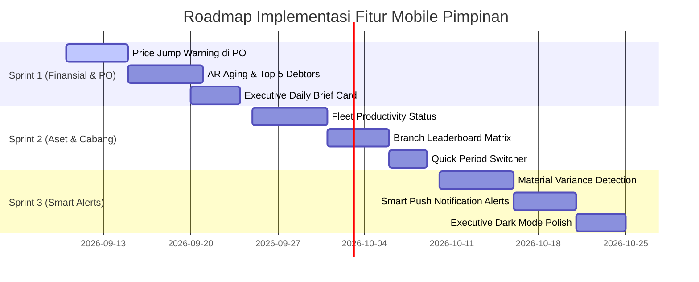

# 📋 ROADMAP FITUR LANJUTAN (NEXT FEATURES) — EXECUTIVE MOBILE INTELLIGENCE
**PT Rajawali Mix — Sistem Terintegrasi CRM & Mobile Application (`RajawaliApp`)**  
*Target Khusus: Level Pimpinan (CEO, FVP, Direksi, Approver)*  
*Dokumentasi Versi: 1.0.0 | Tanggal: 7 September 2026*  

---

## 🎯 Pendahuluan & Latar Belakang

Aplikasi mobile saat ini telah sukses menangani alur dasar verifikasi Purchase Order (`DRAFT` ➔ `SUBMITTED` ➔ `APPROVED` / `REJECTED`) serta metrik agregat global. Namun, untuk pimpinan eksekutif, kebutuhan utama di perangkat seluler bukan sekadar membaca angka mentah (*raw data*), melainkan **Kecerdasan Kontekstual (*Contextual Intelligence*)**, **Pengawasan Anomali (*Management by Exception*)**, dan **Pengambilan Keputusan Instan (*3-Second Glanceable Insights*)**.

Dokumen ini menjadi acuan spesifikasi teknis dan fungsional untuk pengembangan sprint fitur lanjutan (Next Features) khusus pimpinan.

---

## 📑 Matriks Prioritas Fitur Lanjutan

| No | Modul Fitur | Kategori | Tingkat Dampak | Kompleksitas Teknis | Target Rilis |
|:---:|:---|:---|:---:|:---:|:---:|
| **1** | **Contextual PO Approval Intelligence** | Efisiensi Biaya / Approval | 🔥 Sangat Tinggi | Menengah | **Sprint 1** |
| **2** | **AR Aging & Top Debtors (Kolektibilitas Piutang)** | Finansial & Likuiditas | 🔥 Sangat Tinggi | Menengah | **Sprint 1** |
| **3** | **Executive Daily Brief & Periode Cepat** | UI/UX Pimpinan | ⚡ Tinggi | Rendah | **Sprint 1** |
| **4** | **Fleet Productivity & Status Kesiapan Truk Mixer** | Operasional & Aset | ⚡ Tinggi | Menengah | **Sprint 2** |
| **5** | **Branch Performance Leaderboard (Ranking Cabang)** | Manajemen Multicabang | ⚡ Tinggi | Menengah | **Sprint 2** |
| **6** | **Smart Anomaly Alerts (Pemborosan Bahan & Limit Kredit)** | Risk & Governance | 🛡️ Sangat Tinggi | Tinggi | **Sprint 3** |

---

## 1. Fitur 1: Contextual PO Approval Intelligence

### Masalah Saat Ini:
Ketika pimpinan membuka dokumen PO di HP, pimpinan hanya disajikan nomor item, kuantitas, harga, dan total. Pimpinan tidak mengetahui apakah harga barang yang diajukan wajar, sedang mengalami lonjakan harga, atau apakah kuota anggaran belanja cabang sudah menipis.

### Solusi & Spesifikasi Fungsional:
1. **Peringatan Lonjakan Harga (*Price Jump Warning*)**:
   - Memanfaatkan data riwayat dari tabel `MasterItemPriceHistory`.
   - Jika harga satuan yang diajukan $\ge 10\%$ lebih mahal dibanding transaksi sebelumnya:
     - Tampilkan **Badge Peringatan Merah** pada item terkait:  
       > ⚠️ *Harga naik +18.5% dibanding pembelian terakhir (Rp 650.000 pada 12 Agustus 2026).*
     - Tombol cepat **"Lihat Riwayat Harga"** menampilkan grafik mini fluktuasi harga 6 bulan terakhir.
2. **Indikator Pagu Anggaran Cabang (*Budget Burn Rate*)**:
   - Di bagian atas kartu detail PO, sematkan ringkasan anggaran belanja logistik cabang terkait:
     > 📊 *Pagu Belanja Cabang Jayapura: Rp 120.000.000 | Terpakai: Rp 94.500.000 (78.75%) | Sisa: Rp 25.500.000*
   - Berubah warna menjadi **Kuning** jika serapan $\ge 80\%$ dan **Merah** jika melampaui $100\%$.
3. **Info Stok Sisa & Rasio Konsumsi Gudang**:
   - Menampilkan angka stok fisik barang di gudang saat PO diajukan untuk memvalidasi apakah pengadaan ini benar-benar mendesak atau berisiko *overstocking*.

---

## 2. Fitur 2: Financial Health & Analisis Umur Piutang (AR Aging)

### Masalah Saat Ini:
Dashboard hanya menampilkan satu angka tunggal ("Total Piutang Outstanding"). Angka ini tidak memberi tahu pimpinan berapa bagian dari piutang tersebut yang sehat dan berapa yang sudah macet kritis.

### Solusi & Spesifikasi Fungsional:
1. **Piramida Umur Piutang (*Aging Receivables Breakdown*)**:
   - Visualisasi bar horizontal dengan 4 kategori usia faktur jatuh tempo:
     - 🟢 **Lancar**: $< 30$ hari (tagihan baru terbit).
     - 🟡 **Perhatian**: $31 - 60$ hari (perlu diingatkan).
     - 🟠 **Kritis**: $61 - 90$ hari (peringatan penahanan order baru).
     - 🔴 **Macet / Macet Total**: $> 90$ hari (tindakan hukum / penagihan intensif direksi).
2. **Daftar 5 Debitur Terbesar (*Top 5 Debtors Card*)**:
   - Menampilkan 5 pelanggan dengan akumulasi piutang tertinggi dan status keterlambatan hari terlama.
   - **One-Tap Direct Actions**:
     - 📞 Tombol telepon langsung ke PIC Keuangan / Pimpinan pelanggan.
     - 💬 Tombol WhatsApp langsung yang membuat pesan konfirmasi saldo piutang otomatis.
3. **Proyeksi Arus Kas Bersih (*Cash In vs Cash Out Outlook*)**:
   - Komparasi kas masuk aktual dari pelunasan invoice vs komitmen kas keluar (total PO approved + realisasi pengeluaran kas lapangan RBL).

---

## 3. Fitur 3: Executive Daily Brief & UI/UX Khusus Pimpinan

### Masalah Saat Ini:
Layar beranda mengharuskan pimpinan men-scroll ke bawah dan menganalisa berbagai kartu data secara manual.

### Solusi & Spesifikasi Fungsional:
1. **Executive Daily Brief Card (3-Second Glance)**:
   - Terletak di posisi paling atas layar Home pimpinan:
     ```
     ┌─────────────────────────────────────────────────────────────┐
     │ 🌤️ Ringkasan Eksekutif Hari Ini — 7 Sep 2026                │
     │ Status: 🟢 OPERASIONAL PRIMA                                │
     │ • Produksi: 184 m³ (+12% melampaui target harian)           │
     │ • 3 PO menunggu persetujuan Anda (Total Rp 18.400.000)      │
     │ • Penagihan Masuk Hari Ini: Rp 45.000.000                   │
     │ • 0 Insiden armada mixer dilaporkan                         │
     └─────────────────────────────────────────────────────────────┘
     ```
2. **Saklar Periode Waktu Cepat (*Quick Period Switcher*)**:
   - Tombol segmented kontrol di bagian header:
     `[ Hari Ini ]` `[ Minggu Ini ]` `[ Bulan Ini ]` `[ YTD (Tahun Ini) ]`
   - Menghilangkan kerumitan memilih tanggal dari dialog kalender manual.
3. **Visualisasi Ringkas Berbasis Sparkline & Gauge**:
   - Grafik mini 7 hari (*sparkline*) di dalam kartu volume produksi beton.
   - Indikator *speedometer gauge* untuk pencapaian target bulanan (misal target 3.000 $m^3$, tercapai 64%).
4. **Tema Gelap Elegan (*Executive Dark Mode*)**:
   - Desain kontras tinggi bernuansa Slate / Deep Blue yang ramah mata saat pimpinan memeriksa data di malam hari.

---

## 4. Fitur 4: Utilisasi Aset & Produktivitas Armada Mixer (Fleet Productivity)

### Masalah Saat Ini:
Pimpinan tidak mengetahui status fisik armada truk mixer di lapangan — berapa yang produktif, berapa yang menganggur, dan berapa yang rusak.

### Solusi & Spesifikasi Fungsional:
1. **Rasio Keaktifan Truk Mixer (*Fleet Availability Ratio*)**:
   - Donut chart interaktif yang menampilkan komposisi armada:
     - 🟢 **Jalan / Mengantar Beton** (Sedang perjalanan trip ke proyek).
     - 🟡 **Standby di Plant** (Siap mengisi adukan).
     - 🔴 **Perbaikan / Bengkel / Rusak** (Tidak beroperasi).
2. **Produktivitas Rata-Rata per Mixer**:
   - Metrik rata-rata trip per mixer hari ini: $\text{Rata-rata Ritase} = \frac{\text{Total Trip Selesai}}{\text{Jumlah Mixer Aktif}}$
   - Memberi peringatan jika rata-rata trip $< 3$ trip/hari yang menandakan inefisiensi penjadwalan antrean (*bottleneck dispatching*).
3. **Tingkat Utilisasi Batching Plant (*Plant Utilization Rate*)**:
   - Membandingkan volume produksi aktual dengan kapasitas terpasang teknis pabrik (misal: kapasitas 60 $m^3$/jam $\times$ 8 jam kerja = 480 $m^3$/hari).

---

## 5. Fitur 5: Perbandingan Kinerja Antar-Cabang (Cross-Branch Leaderboard)

### Masalah Saat Ini:
Pimpinan harus memilih filter cabang satu per satu untuk mengetahui cabang mana yang berkinerja tinggi dan mana yang tertinggal.

### Solusi & Spesifikasi Fungsional:
1. **Papan Peringkat Cabang (*Branch League Table*)**:
   - Komparasi ranking cabang PT Rajawali Mix (Jayapura, Sorong, dsb.) dalam bentuk kartu ringkas:
     - **Peringkat Volume Produksi**: Mengurutkan cabang dengan kubikasi tertinggi bulan ini.
     - **Peringkat Efisiensi Kas Kecil**: Cabang dengan rasio serapan RBL paling hemat & tertib nota.
     - **Peringkat Kolektibilitas Tagihan**: Cabang dengan persentase penagihan piutang tercepat.
2. **Kinerja vs Target Cabang**:
   - Bar persentase warna-warni pencapaian target volume bulanan masing-masing cabang.

---

## 6. Fitur 6: Manajemen Pengecualian & Smart Push Alerts (Management by Exception)

### Masalah Saat Ini:
Pimpinan hanya menerima notifikasi saat ada PO baru yang diajukan. Anomali operasional lain baru diketahui saat akhir bulan saat laporan keuangan diterbitkan.

### Solusi & Spesifikasi Fungsional:
1. **Alert Deviasi / Pemborosan Semen (*Material Variance Alert*)**:
   - Jika sistem mendeteksi rasio pemakaian semen aktual pada transaksi produksi melebihi $\pm 3\%$ dari standar formula racikan mutu beton (indikasi kebocoran semen atau kalibrasi timbangan bermasalah), pimpinan menerima push alert darurat.
2. **Alert Plafon Kredit Customer Terlampaui**:
   - Jika ada order pengecoran baru untuk pelanggan yang piutangnya sudah menunggak $> 60$ hari atau saldo depositnya telah minus.
3. **Alert Kas Lapangan Kritis**:
   - Jika kas operasional cabang (RBL) terserap $> 80\%$ padahal baru tanggal 10 dalam bulan berjalan.

---

## 7. Kebutuhan Penambahan Endpoint Backend API

Untuk mendukung fitur-fitur di atas, berikut rencana endpoint API yang akan disiapkan di backend:

| Endpoint | Method | Fungsi Utama | Keterangan Data |
|---|:---:|---|---|
| `/api/dashboard/executive/brief` | `GET` | Ringkasan harian 3-detik | Produksi hari ini, pending PO, cash in, alert armada |
| `/api/dashboard/executive/ar-aging` | `GET` | Piramida umur piutang & Top 5 Debtors | Kelompok $<30$, $31-60$, $61-90$, $>90$ hari + data kontak debitur |
| `/api/dashboard/executive/fleet-status` | `GET` | Komposisi status truk mixer | Jumlah jalan, standby, bengkel, avg trip/unit |
| `/api/dashboard/executive/branch-ranking` | `GET` | Komparasi leaderboard seluruh cabang | Volume $m^3$, serapan RBL, pencapaian target |
| `/api/po/{id}/price-history` | `GET` | Riwayat harga barang pada PO | Tren harga pembelian 6 bulan terakhir dari `MasterItemPriceHistory` |

---

## 8. Rencana Implementasi Bertahap


