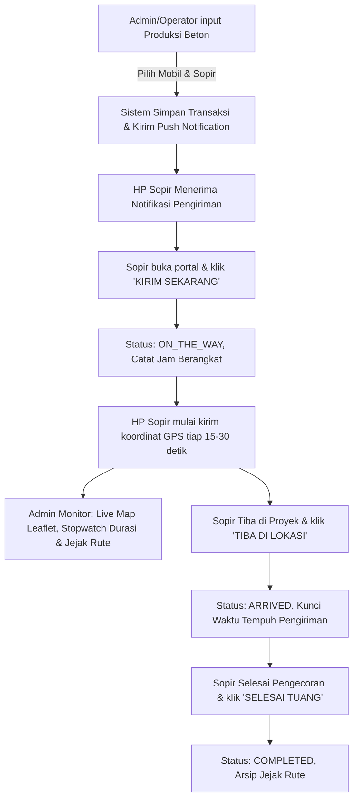

# Dokumentasi Fitur: Live Tracking & Trace Pengiriman Beton (Rp 0)

Dokumen ini berisi hasil analisa, R&D, arsitektur teknis, dan rancangan implementasi fitur **Live Tracking Armada Mixer & Monitoring Pengiriman Beton** tanpa biaya lisensi maupun perangkat tambahan (**Zero Cost / Rp 0**).

---

## 1. Latar Belakang & Tujuan

Dalam operasional *Ready-Mix Concrete* (beton cor), waktu pengiriman adalah faktor kritis:
1. **Initial Setting Time**: Beton memiliki batas waktu pengikatan awal (umumnya 90 - 150 menit dari waktu batching di plant sampai dituang di proyek). Jika waktu pengiriman terlambat, beton berisiko mengalami *slump loss*, mengeras di dalam drum mixer, atau ditolak (*reject*) oleh pihak proyek.
2. **Visibilitas Dispatcher/Admin**: Admin plant sering kesulitan mengetahui apakah mixer sudah berangkat, masih di jalan, terkena macet, atau sudah tiba di lokasi cor.
3. **Kebutuhan Trace & Audit**: Memiliki rekaman jejak rute riil (breadcrumb) dan catatan durasi tempuh resmi untuk menyelesaikan komplain customer atau klaim keterlambatan.

### Target Fitur:
- **Admin/Operator** membuat transaksi beton dan memilih mobil mixer serta sopir.
- **Sopir** otomatis menerima notifikasi di HP.
- Sopir menekan tombol **"KIRIM SEKARANG"** saat keluar dari batching plant.
- Sistem mulai menghitung **lama pengiriman (stopwatch/timer real-time)** dan memantau status keamanan mutu beton.
- Posisi GPS, kecepatan, arah, dan **rute yang dilalui (jejak polyline)** terpantau secara langsung di peta Admin.
- **Biaya Rp 0**: Menggunakan smartphone sopir (BYOD) dan teknologi open-source (tanpa beli GPS tracker hardware, tanpa tagihan Google Maps API).

---

## 2. Analisa Arsitektur: Solusi 0 Biaya (Zero Cost)

| Komponen | Solusi Konvensional (Berbayar Mahal) | Solusi New Rajawali (**Rp 0**) | Keunggulan & Keterangan |
| :--- | :--- | :--- | :--- |
| **Perangkat GPS** | Hardware OBD/Blackbox (Rp 800rb - 1.5jt/truk) + SIM Data Bulanan | **Smartphone Sopir Sendiri (BYOD)** via PWA / Android | Memanfaatkan sensor GPS internal HP sopir yang sudah mendukung GPS + GLONASS + A-GPS berakurasi tinggi. |
| **Engine Peta** | Google Maps Platform API ($7 / 1.000 load peta) | **OpenStreetMap (OSM) + Leaflet.js** | 100% Open-source, tanpa biaya langganan, tanpa kartu kredit, tanpa batas kuota. |
| **Layanan Routing** | Google Directions API ($5 / 1.000 panggilan) | **GPS Breadcrumb Trail (Polyline)** | Rute dibentuk langsung dari rekaman titik-titik koordinat riil yang dilewati kendaraan dari Plant ke Proyek. |
| **Push Notifikasi** | SMS Gateway / WhatsApp OTP berbayar | **Web Push API (VAPID) / Firebase (FCM)** | Gratis tak terbatas. Codebase New Rajawali sudah memiliki dependensi `web-push` dan Firebase Admin. |
| **Data Real-time** | Platform Fleet Management Berlangganan | **Pusher Free Tier / Server-Sent Events (SSE)** | Pusher gratis 200.000 pesan/hari atau SSE mandiri di server VPS sendiri (unlimited). |

---

## 3. Alur Kerja Pengguna (User Flow)



### Tahap 1: Pembuatan Transaksi di Plant (Admin/Operator)
1. Operator membuat transaksi di menu `/admin/produksi`.
2. Mengisi parameter: Mutu Beton (misal: K-250), Volume (misal: 7 m³), Slump, Proyek Tujuan, Kendaraan Mixer, dan Sopir.
3. Saat data tersimpan, sistem memicu notifikasi push ke akun sopir terkait.

### Tahap 2: Aksi Sopir di Lapangan (Driver Portal)
1. Sopir menerima notifikasi: *"Tugas Pengiriman Baru: Mutu K-250, 7 m³ ke Proyek Sudirman (TM-3)"*.
2. Sopir membuka portal driver (PWA `/driver` yang simpel dan cepat).
3. Setelah proses pengisian beton selesai di batching plant, sopir menekan tombol **"KIRIM SEKARANG" (Berangkat)**.
4. Sistem mencatat `departureTime = NOW()`.
5. Status transaksi berubah menjadi `ON_THE_WAY`.

### Tahap 3: Pemantauan Real-time (Tracking & Waktu Tempuh)
1. **Perhitungan Durasi Pengiriman**:
   - Stopwatch berjalan secara otomatis di layar Admin dan Driver.
   - Indikator visual batas mutu beton:
     - 🟢 **Hijau (Aman)**: < 60 menit
     - 🟡 **Kuning (Waspada)**: 60 - 90 menit
     - 🔴 **Merah (Kritis / Risiko Setting)**: > 90 menit
2. **Pengiriman Koordinat GPS**:
   - Perangkat driver mengirimkan `lat`, `lng`, `speed`, dan `heading` setiap 15–30 detik ke endpoint server.
   - Titik-titik ini digambar sebagai garis rute (*polyline*) di peta interaktif admin.

### Tahap 4: Tiba di Proyek & Pengecoran
1. Saat tiba di gerbang lokasi proyek, sopir menekan tombol **"TIBA DI PROYEK"**.
   - Sistem mencatat `arrivalTime = NOW()`.
   - Total lama waktu pengiriman resmi terkunci dan dicatat di database (misal: *42 menit 20 detik*).
2. Setelah penuangan selesai, sopir menekan **"SELESAI TUANG"**.
   - Status menjadi `COMPLETED`. Riwayat rute diarsipkan untuk audit dan evaluasi efisiensi rute.

---

## 4. Solusi Tantangan Teknis HP Driver (Field Reliability)

### Tantangan 1: Layar HP Sopir Sleep / Aplikasi Diminimize
- **Solusi PWA (Screen Wake Lock API)**:
  Saat sopir menekan "Kirim Sekarang", aplikasi mengaktifkan:
  ```javascript
  if ('wakeLock' in navigator) {
    const wakeLock = await navigator.wakeLock.request('screen');
  }
  ```
  Layar HP sopir tetap menyala (seperti Google Maps / Waze) menampilkan dashboard perjalanan sederhana. Selama layar menyala, browser tidak akan menidurkan thread GPS.
- **Solusi Native Android (Foreground Service)**:
  Jika menggunakan aplikasi di folder `android_app`, implementasikan Foreground Service dengan persistent notification bar: *"Rajawali Driver: Pengiriman Beton Aktif"*. GPS tetap terkirim meskipun layar mati.

### Tantangan 2: Area Blank Spot (Sinyal Lemah di Perjalanan)
- Titik koordinat GPS sementara disimpan di **IndexedDB / LocalStorage** HP sopir.
- Saat koneksi internet kembali stabil, titik-titik koordinat yang tertunda langsung dikirim secara batch (*batch sync*) ke server sehingga rute tidak terputus.

---

## 5. Rancangan Skema Database (Prisma)

### Modifikasi Model `ProductionTransaction`
```prisma
model ProductionTransaction {
  // Field lama yang sudah ada...
  
  // Field baru untuk pelacakan pengiriman
  departureTime     DateTime?             // Waktu driver klik "Kirim Sekarang"
  arrivalTime       DateTime?             // Waktu driver tiba di proyek
  completionTime    DateTime?             // Waktu selesai pengecoran
  deliveryDuration  Int?                  // Total durasi pengiriman dalam detik
  deliveryStatus    DeliveryStatus        @default(PENDING)
  
  // Relasi rekaman jejak koordinat rute
  locationLogs      VehicleLocationLog[]

  @@index([deliveryStatus])
}

enum DeliveryStatus {
  PENDING       // Menunggu berangkat dari plant
  ON_THE_WAY    // Sedang dalam perjalanan pengiriman
  ARRIVED       // Sudah sampai di lokasi proyek
  COMPLETED     // Selesai bongkar/tuang beton
  CANCELLED     // Dibatalkan
}
```

### Model Baru: `VehicleLocationLog` (Jejak Breadcrumb)
```prisma
model VehicleLocationLog {
  id              String                @id @default(uuid())
  transactionId   String
  transaction     ProductionTransaction @relation(fields: [transactionId], references: [id], onDelete: Cascade)
  latitude        Float
  longitude       Float
  speed           Float?                // Kecepatan dalam km/h
  heading         Float?                // Arah kompas kendaraan (derajat 0-360)
  accuracy        Float?                // Akurasi sinyal GPS dalam meter
  recordedAt      DateTime              @default(now())

  @@index([transactionId, recordedAt])
}
```

---

## 6. Spesifikasi API Endpoint

### 1. `POST /api/tracking/ping`
Endpoint yang dipanggil berkala (tiap 15-30 detik) oleh HP sopir:
```json
// Request Body
{
  "transactionId": "cm...uuid",
  "latitude": -5.147665,
  "longitude": 119.432731,
  "speed": 34.5,
  "heading": 180.2,
  "accuracy": 12.0
}

// Response
{
  "success": true,
  "status": "ON_THE_WAY",
  "serverTime": "2026-09-08T15:30:00Z"
}
```

### 2. `POST /api/tracking/status`
Endpoint perubahan status perjalanan pengiriman:
```json
// Request Body
{
  "transactionId": "cm...uuid",
  "action": "START_DELIVERY" // Opsi: START_DELIVERY | ARRIVE | COMPLETE
}
```

### 3. `GET /api/tracking/[transactionId]`
Endpoint untuk mengambil live posisi dan riwayat jejak rute (polyline) untuk ditampilkan di peta Admin:
```json
// Response
{
  "transaction": {
    "id": "cm...uuid",
    "mixerCode": "M-08",
    "plateNumber": "DD 8765 RA",
    "driverName": "Pak Joko",
    "quality": "K-250",
    "volume": 7,
    "departureTime": "2026-09-08T15:00:00Z",
    "durationMinutes": 32,
    "status": "ON_THE_WAY"
  },
  "currentLocation": { "latitude": -5.147665, "longitude": 119.432731 },
  "route": [
    [-5.132000, 119.410000],
    [-5.138000, 119.418000],
    [-5.147665, 119.432731]
  ]
}
```

---

## 7. Desain Antarmuka (UI/UX)

### Sisi Driver (HP Sopir - `/driver`)
1. Tampilan antarmuka khusus mobile yang simpel dan kontras tinggi.
2. Kartu Surat Jalan Digital:
   - Nomor Polisi / Mixer
   - Proyek Tujuan & Alamat Lengkap
   - Mutu Beton & Volume
3. Tombol Aksi Cepat (One-Tap):
   - 🟢 **"KIRIM SEKARANG (BERANGKAT)"**
   - 🔵 **"TIBA DI PROYEK"**
   - ⚪ **"SELESAI TUANG"**
4. Indikator Status: Waktu tempuh berjalan dan status akurasi GPS (Hijau: Aktif, Merah: GPS Mati).

### Sisi Admin (Web Monitoring - `/admin/monitoring-armada`)
1. **Peta Interaktif (Leaflet + OpenStreetMap)**:
   - Marker Plant (titik tolak).
   - Marker Mixer bergerak secara real-time.
   - Polyline biru menggambarkan rute aktual yang telah dilewati truk.
2. **Panel Status Armada**:
   - Daftar mixer yang sedang *On The Way*.
   - Timer durasi tempuh real-time (*00:41:20*).
   - Badge peringatan waktu mutu beton (Normal / Waspada / Kritis).

---

## 8. Rencana Tahapan Implementasi (Roadmap)

- **Fase 1: Database & Fondasi API**
  - Update skema Prisma (`ProductionTransaction` status + `VehicleLocationLog`).
  - Implementasi endpoint `/api/tracking/status` dan `/api/tracking/ping`.
- **Fase 2: Portal Driver Mobile (PWA)**
  - Pembuatan halaman `/driver` dengan autentikasi sopir.
  - Integrasi tombol "Kirim Sekarang", penghitungan waktu tempuh, dan pelacak GPS background dengan Screen Wake Lock.
- **Fase 3: Peta Monitoring Admin**
  - Integrasi Leaflet.js + OpenStreetMap di dashboard admin.
  - Tampilan live marker mixer dan garis lintasan rute kendaraan.
- **Fase 4: Otomasi Notifikasi & Polishing**
  - Trigger notifikasi Web Push / FCM otomatis saat form produksi dibuat.
  - Sinkronisasi offline (IndexedDB) jika sopir melewati area tanpa sinyal seluler.
