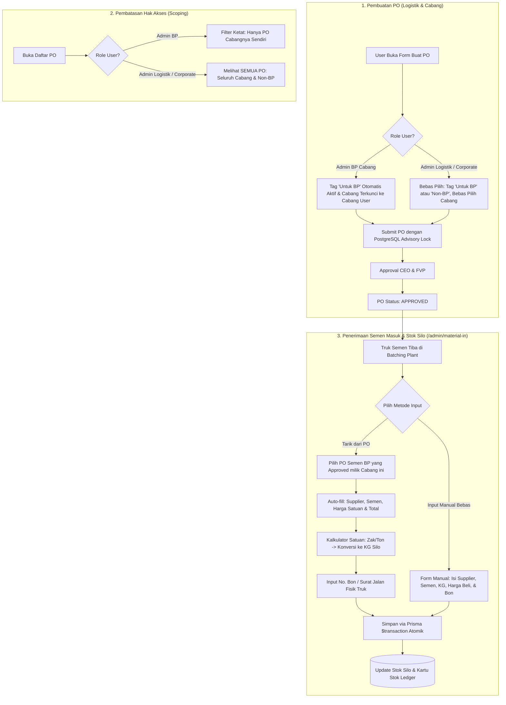

# Dokumentasi Fitur: Integrasi PO Logistik dengan Semen Masuk & Stok Silo Batching Plant

Dokumen ini berisi hasil analisa bisnis, arsitektur teknis, isolasi hak akses (RBAC Scoping), penanganan *race condition*, analisa data eksisting, dan rancangan implementasi fitur **Integrasi Purchase Order (PO) Logistik dengan Semen Masuk & Kartu Stok Silo**.

---

## 1. Latar Belakang & Tujuan

Dalam operasional Batching Plant (BP), semen merupakan material primer paling bernilai tinggi yang disimpan dalam tangki Silo vertikal. Saat ini:
1. **Pencatatan Semen Masuk (`/admin/material-in`) Masih Terisolasi:** Dilakukan 100% manual tanpa referensi nomor PO Logistik.
2. **Tidak Ada Pencatatan Harga Beli di Silo:** Modul Semen Masuk hanya mencatat tonase (KG), tanpa data harga satuan (Rp/kg atau Rp/zak) maupun total nilai pembelian.
3. **Kebutuhan Kontrol Rantai Pasok:** Pembelian semen dilakukan melalui modul PO Logistik (`/logistik/po`). Namun, PO Logistik digunakan untuk berbagai kebutuhan: baik untuk material Batching Plant (semen silo) maupun untuk proyek non-BP (pekerjaan sipil luar, kontraktor umum, BBM, sparepart, dll).
4. **Desentralisasi Pembuatan PO Cabang:** Cabang BP membutuhkan hak akses untuk membuat PO material/kebutuhan mereka sendiri, dengan pembatasan agar admin cabang tidak dapat melihat seluruh PO yang dibuat oleh Logistik Pusat.

### Target Fitur:
- **Tagging Peruntukan PO**: Penanda jelas saat buat PO apakah pesanan ditujukan **"Untuk Batching Plant (BP)"** atau **"Proyek Non-BP / Operasional Umum"**.
- **Otomatisasi Cabang untuk Admin BP**: Jika Admin BP membuat PO, tag "Untuk BP" otomatis aktif dan Cabang otomatis terkunci ke cabangnya sendiri.
- **Isolasi Data (Scoping)**: Admin BP hanya dapat melihat PO cabangnya sendiri; Admin Logistik & Corporate dapat melihat seluruh PO.
- **Dual Mode di Semen Masuk**:
  - *Mode 1: Tarik dari PO* $\rightarrow$ Otomatis mengisi Supplier, Merek Semen, Harga Satuan, Total Nilai, dan konversi Zak/Ton ke KG Silo.
  - *Mode 2: Input Manual* $\rightarrow$ Fleksibilitas tetap terjaga untuk penerimaan darurat/tanpa PO.
- **Pencatatan Harga**: Nilai aset semen masuk dan harga per satuan tercatat rapi di database dan kartu stok.
- **Zero Race Condition**: Penomoran PO dan penerimaan stok aman dari tabrakan transaksi simultan.
- **Zero Data Loss**: Skema database dirancang aditif dan *backward-compatible* dengan 1.101 PO yang sudah ada.

---

## 2. Alur Kerja Sistem (Workflow Architecture)



---

## 3. Spesifikasi Fungsional

### A. Tag Peruntukan PO & Hak Akses Pembuatan

| Fitur / Validasi | Admin BP (Cabang) | Admin Logistik & SuperAdminBP |
| :--- | :--- | :--- |
| **Hak Akses Buat PO** | Diizinkan (memerlukan permission `LOGISTIK_CREATE`) | Diizinkan penuh |
| **Tag "Untuk BP" (`is_for_bp`)** | **Default Aktif (`true`)** | **Fleksibel**: Dicentang jika untuk BP, tidak dicentang jika proyek non-BP |
| **Pemilihan Cabang (`locationId`)** | **Terkunci Otomatis (Readonly)** ke cabang user (`session.user.locationId`) | **Bebas Memilih** cabang dari dropdown (atau kosong jika non-BP) |
| **Server-Side Guard** | Server memvalidasi dan memaksa `locationId = session.user.locationId` dan `is_for_bp = true` | Menerima `locationId` yang dipilih |

### B. Isolasi Data Daftar PO (Scoping)
1. **Query `getPurchaseOrders`**:
   - Jika `!isCorporateUser(session.user)`:
     - Filter otomatis `where.locationId = session.user.locationId`.
     - Admin BP tidak akan pernah melihat PO non-BP maupun PO milik cabang lain.
   - Jika `isCorporateUser(session.user)`:
     - Menampilkan seluruh PO, dengan opsi dropdown filter per cabang.
2. **Query `getPurchaseOrderById`**:
   - Akses via URL langsung (`/logistik/po/[id]`) diblokir jika user non-corporate mencoba membuka PO milik cabang lain.

### C. Modul Semen Masuk & Stok Silo (Dual Mode & Kalkulator 2-Arah)
1. **Tarik dari PO Logistik**:
   - Menampilkan dropdown PO dengan filter:
     - Kategori: `SEMEN` (`SMN`)
     - Status: `APPROVED`
     - Peruntukan: `is_for_bp === true`
     - Cabang: Sesuai cabang user (`locationId`)
   - Memilih PO langsung memuat data:
     - Distributor / Supplier
     - Merek / Nama Semen
     - Harga Satuan (Rp)
     - Sisa kuantitas PO yang belum dikirim
2. **Kalkulator Satuan Fleksibel (Semen Curah Truk Kapsul & Kantong Sak)**:
   - **Truk Kapsul Curah (`KAPSUL`)**: Mengakomodir pembelian per 1 truk tangki kapsul curah dengan harga pasar fluktuatif.
     - User cukup input `Harga Satuan per Kapsul` atau langsung ketik `Total Nilai Tagihan/Faktur (Rp)`.
     - Tonase Silo Riil (KG) diinput dari timbangan jembatan fisik (cth: 15.200 KG).
     - Sistem otomatis menghitung harga ekuivalen riil Silo: $\text{Total} / \text{Tonase KG}$ (cth: ~Rp 2.072/KG atau ~Rp 2.072.000/Ton).
   - **Ton Curah (`TON`)**: Pembelian berbasis berat tonase ($\text{Ton} \times 1.000$ KG).
   - **Zak 50 KG (`ZAK_50`) & Zak 40 KG (`ZAK_40`)**: Untuk semen kantong sak.
   - **Kilogram (`KG`)**: Langsung dalam satuan KG.
3. **Perhitungan Dua Arah (Bidirectional)**:
   - Input **Harga Satuan** $\times$ **Jumlah Beli** $\rightarrow$ **Total Nilai** terhitung otomatis.
   - Atau langsung input **Total Nilai Faktur (Rp)** $\rightarrow$ **Harga Satuan** otomatis terhitung ($\text{Total} / \text{Jumlah Beli}$).
   - **Auto-Detect Data Lama**: Saat membuka data lama yang belum berharga (seperti 15.200 KG), sistem otomatis mendeteksi tonase besar (>5.000 KG) sebagai `KAPSUL` sehingga admin cukup mengetik total faktur tanpa perlu menghitung desimal per kg secara manual.
4. **Input Manual Bebas**:
   - Form input manual tetap ada tanpa mewajibkan nomor PO.
   - Dilengkapi seluruh kemudahan kalkulator 2-arah di atas.

---

## 4. Analisis Data Eksisting (Baseline Database)

Pemeriksaan aktual pada database production/staging menghasilkan temuan berikut:

| Entitas | Kondisi Eksisting | Dampak & Penanganan Fitur Baru |
| :--- | :--- | :--- |
| **1.101 PO Lama** | Seluruh 1.101 PO lama memiliki `locationId = null` dan dibuat oleh Logistik Pusat. | **Sangat Selaras:** Seluruh 1.101 PO lama otomatis berstatus `is_for_bp = false` dan tersembunyi dari Admin BP, namun tetap terlihat lengkap oleh Admin Logistik/Corporate. |
| **9 PO Kategori Semen Lama** | 8 Approved, 1 Cancelled. Item menggunakan satuan `zak` (misal 80, 120, 160 zak) dengan harga rata-rata Rp 99.000/zak. | Membuktikan secara nyata bahwa konversi satuan dari `zak` ke `KG Silo` adalah kebutuhan riil operasional. 9 PO lama dapat dibiarkan sebagai arsip historis. |
| **Data Semen Masuk Eksisting** | Ada 1 record penerimaan di Cabang Sorong (15.200 KG) tanpa harga dan tanpa relasi PO. | Dengan menambahkan kolom harga dan relasi PO sebagai *nullable*, data lama tetap utuh dan kartu stok tidak berubah. |

---

## 5. Strategi Pencegahan Race Condition (Concurrency Safety)

### A. Race Condition Penomoran PO (`po_number`)
- **Masalah:** Dua admin (misal Admin BP Youtefa dan Admin BP Sorong) menekan "Simpan PO" pada detik yang sama untuk kategori yang sama (`SMN`). Keduanya membaca nomor urut terakhir yang sama (misal 15) dan mencoba membuat nomor `016`.
- **Solusi:**
  1. **PostgreSQL Advisory Lock (Transaksional):**
     ```ts
     await prisma.$executeRaw`SELECT pg_advisory_xact_lock(hashtext(${'po_seq_' + companyGroupId + '_' + categoryId}))`
     ```
     Lock ini menahan transaksi kedua selama beberapa milidetik hingga transaksi pertama selesai commit, menjamin nomor urut berikutnya naik teratur tanpa konflik.
  2. **Database Unique Constraint (`@unique`):** Constraint unik pada kolom `po_number` sebagai barikade lapis kedua.
  3. **UI Single-Flight:** Tombol simpan otomatis disabled (`saving = true`) pada klik pertama.

### B. Race Condition Pengambilan PO di Semen Masuk
- **Masalah:** Dua user mencatat penerimaan semen dari nomor PO yang sama secara bersamaan, berisiko mencatat penerimaan melebihi kuantitas PO.
- **Solusi:**
  1. **Prisma `$transaction` Atomik:** Pencatatan semen masuk dibungkus dalam transaksi atomik untuk memeriksa akumulasi yang sudah diterima vs kuantitas PO.
  2. **Idempotency Validasi No Bon:** Memeriksa kombinasi No. Bon fisik dan tanggal untuk mencegah pencatatan berulang (double receipt).

---

## 6. Perubahan Skema Database (`prisma/schema.prisma`)

Perubahan dirancang bersifat **Non-Destructive** (kolom baru bernilai *nullable* atau memiliki *default value*):

```prisma
// ─── 1. Penambahan pada Model PurchaseOrder ───
model PurchaseOrder {
  // ... field yang sudah ada ...
  
  is_for_bp         Boolean            @default(false) // Tag peruntukan BP
  materialIncomings MaterialIncoming[]
}

// ─── 2. Penambahan pada Model MaterialIncoming ───
model MaterialIncoming {
  id              String         @id @default(uuid())
  date            DateTime
  material_type   MaterialType   @default(Semen)
  name            String         // Merek semen (e.g. Semen Tonasa 50kg)
  supplier        String         // Distributor
  tonnage         Float          // Disimpan dalam satuan KG untuk Silo
  delivery_note   String         // No. Surat Jalan / No. Bon fisik
  location        Location       @relation(fields: [locationId], references: [id])
  locationId      String

  // Kolom Harga & Satuan Pembelian (Baru)
  unit_price      Float?         @default(0)   // Harga per satuan (Rp)
  total_price     Float?         @default(0)   // Total nominal pembelian (Rp)
  purchase_unit   String?        @default("KG") // "KG" | "ZAK_50" | "ZAK_40" | "TON"
  purchase_qty    Float?                       // Jumlah saat beli (misal: 80 zak)

  // Referensi PO Logistik (Baru - Nullable untuk manual)
  purchaseOrderId String?
  purchaseOrder   PurchaseOrder? @relation(fields: [purchaseOrderId], references: [id])
  poItemId        String?
  poItem          PoItem?        @relation(fields: [poItemId], references: [id])

  @@index([date])
  @@index([locationId, date])
  @@index([purchaseOrderId])
}
```

---

## 7. Rencana Tahapan Implementasi

1. **Tahap 1: Migrasi Skema Database**
   - Menambahkan field baru pada model `PurchaseOrder` dan `MaterialIncoming` di `schema.prisma`.
   - Menjalankan migrasi database yang aman (tanpa menghapus data).
2. **Tahap 2: Scoping & Form Pembuatan PO**
   - Menambahkan filter cabang berbasis role di `getPurchaseOrders` dan `getPurchaseOrderById`.
   - Menambahkan switch tag "Untuk BP" di form create PO (`po-create-client.tsx`).
   - Menerapkan penguncian otomatis cabang untuk role non-corporate.
   - Memasang `pg_advisory_xact_lock` pada pembuatan nomor PO.
3. **Tahap 3: Backend Penarikan PO Semen**
   - Membuat server action `getApprovedBpCementPOs(locationId)` untuk mengambil daftar PO semen approved yang siap diterima di cabang bersangkutan.
4. **Tahap 4: Form Semen Masuk Dual Mode & Kalkulator Silo**
   - Memperbarui `material-in-form.tsx` dengan tab/toggle *"Tarik dari PO"* dan *"Input Manual"*.
   - Mengimplementasikan kalkulator konversi satuan Zak/Ton ke KG Silo serta perhitungan total harga otomatis.
5. **Tahap 5: Tabel Data & Kartu Stok**
   - Menampilkan kolom Harga Satuan, Total Nilai Pembelian, dan badge referensi PO pada tabel data Semen Masuk (`material-in-client.tsx`).
   - Menampilkan ringkasan penerimaan parsial di detail PO Logistik.
